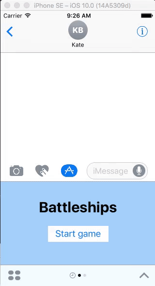
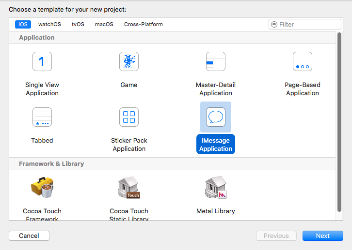
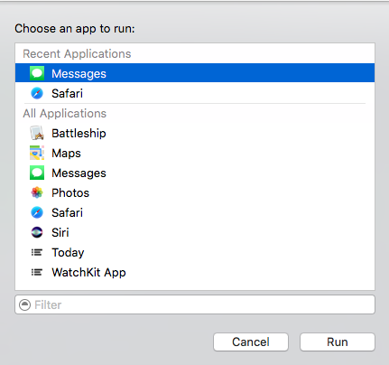
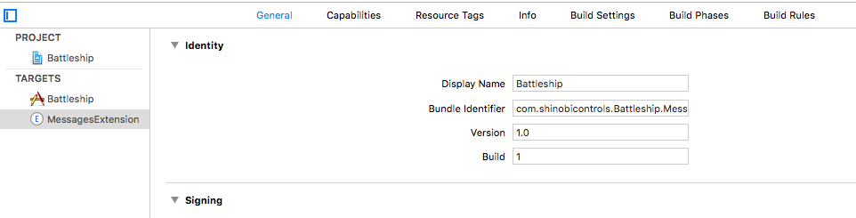
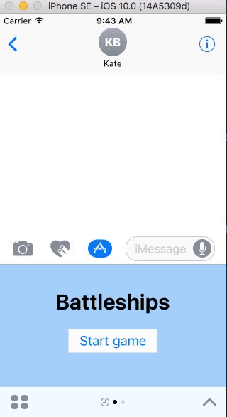
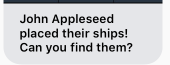

# iOS10 Day by Day

___

# Messages

Messages saw a **huge** update in iOS 10. It's likely this was in an effort to steal back market share from the big guns: Facebook Messenger, WeChat and Snapchat.

One of the new features was the ability for 3rd-party developers to create their own message extensions that can be used from within the Messages application. These are built on top of the extensions technology introduced in iOS 8, which Sam Davies [blogged about](https://www.shinobicontrols.com/blog/ios8-day-by-day-day-2-sharing-extension) as part of a previous series. The nice thing about message extensions is that your extension can exist on its own without having to be bundled as part of a parent application. When iOS 10 is released later this year a whole raft of extensions will be available to users from a dedicated Messages App Store.

To demonstrate this exciting new extension type, we'll take a look at a project that allows two players to play a simplified version of the popular game, Battleships. To keep things simple on the layout constraints front, I've only considered using the device in 'portrait'.



Rules of the game:

- One player sets up the game and positions their two 'ships'
- The other player has to then guess the locations of the ships
- Location guesser wins the game if they 'hit' the two hidden ships without missing three times.

## Creating the Project

Xcode makes it very simple to get started with your extension. Simply click `File -> New -> Project` and then select the iMessage Application template.



Aside from naming our project (I chose Battleship, but feel free to come up something a little wittier!) and ensuring the language was set to Swift, that's pretty much all we need to do. The Messages app will automatically recognize our extension when we run the project thanks to the auto-generated `MessagesExtension` target and the associated `Info.plist` which declares all we need to get started (the storyboard that defines the interface of the extension and the type of extension we're building).

## Changing the Display Name

If you run the `MessagesExtension` target in the simulator you should be prompted to choose an application to run the extension inside of. We want to choose 'Messages'.



> When Messages opens we should see our extension shown in the area beneath the message input. If not, then you may need to select the 'Applications' icon, then the icon which looks a little like four ellipses and selecting our extension from the list.

It's a little bland at the moment, but we'll soon change that. For now, the most pressing matter is to alter the 'display name' of our extension: it currently reads 'MessagesExtension' (actually it's more like 'MessagesEx...' because it's truncated). We can change this by clicking on our target and then altering the `Display Name` field.



## Game Board

We want some way of displaying a 3x3 grid. There are many ways of doing this but I opted for using a UICollectionView. As it isn't too important for this tutorial I've left out the nitty gritty of how it's implemented.

## Models

To help define our game and keep track of its state we have a couple of structs to helps us:

```swift
struct GameConstants {
    /// Number of ships to place on screen
    static let totalShipCount = 2
    /// The number of attempts the player can have at destroying opponent's ships
    static let incorrectAttemptsAllowed = 3
}

struct GameModel {
    /// The cell locations of the ships
    let shipLocations: [Int]
    /// Whether the game has been completed or is still in progress
    var isComplete: Bool
}
```

## MessagesViewController

`MessagesViewController` is the entry point to our extension. A subclass of `MSMessagesAppViewController`, this acts as the root view controller for Messages extensions. The template includes an abundance of methods that we can override for responding to fine-grained situations, such as when the user receives a message while the extension is open. We'll just be making use of a few of these.

The first thing to note is that our extension can be in two `MSMessagesAppPresentationStyle`s when open:

- `compact`
- `expanded`

`compact` will be the style used when the extension is opened by the user from the applications drawer and is presented in the keyboard area. The `expanded` style gives the extension a little more breathing room by taking up most of the screen.

To keep our codebase relatively tidy, we'll split the two presentation styles into separate view controllers, which we'll then add as child view controllers of `MessagesViewController`.

## Child View Controllers

We won't spend too much time looking at the implementation of these controllers and instead focus on the sending of messages along with data about the game state. Please feel free to browse through the code on Github.

### GameStartViewController

When our extension is first opened we'll be in the `compact` presentation style. Particularly on an iPhone this isn't really enough space to display our grid. We could simply request to transition immediately to the `expanded` style, however Apple warn against doing this as, ultimately, the user should be in control.

We'll display a simple title screen consisting of a label and a button. When this button is tapped we'll transition to the main game screen so the user can start positioning their ships.

### Ship Location View Controller

This is the controller where the game initiator chooses where their ships should be located.

We hook in to the `gameBoard`'s `onCellSelection` handler so we can manage the styling of the cells. Those that have a ship positioned on them will be displayed green whereas the empty cells will remain blue.

When `shipsLeftToPosition` returns 0 we enable the finish button. The button is hooked up to an `IBAction` called `completedShipLocationSelection:` which creates a model of the game and using an extension on UIImage to create a snapshot of the game board (we `reset()` the board so when we create an image the locations chosen for the ships are hidden - we don't want to reveal these quite yet!). This snapshot will come in handy when we insert a message later.

### Ship Destroy View Controller

When the other player selects the message in the conversation we want them to see a slightly different view controller - one which will enable them to search for the hidden battleships.

We again hook into the board's `onCellSelection` handler. This time we mark a cell as green (a 'hit') if the cell location matches one picked by the other player, otherwise we mark it as a 'miss' by coloring the cell red.

When a game is completed, either due to the player running out of lives or finding the two ships we configure the model appropriately and then call the completion handler.

## Adding the Child Controllers

Returning to our `MessagesViewController`, we can now hook up add our child controllers to it.

```swift
class MessagesViewController: MSMessagesAppViewController {
    override func willBecomeActive(with conversation: MSConversation) {
        configureChildViewController(for: presentationStyle, with: conversation)
    }

    override func willTransition(to presentationStyle: MSMessagesAppPresentationStyle) {
        guard let conversation = self.activeConversation else { return }
        configureChildViewController(for: presentationStyle, with: conversation)
    }
}
```

These two methods, provided by `MSMessagesAppViewController`, alert us when our extension becomes active (i.e. is opened by the user) and when the view controller will transition to a new presentation style. We'll use them to configure our child view controllers.

```swift
private func configureChildViewController(for presentationStyle: MSMessagesAppPresentationStyle,
                                              with conversation: MSConversation) {
    // Remove any existing child view controllers
    for child in childViewControllers {
        child.willMove(toParentViewController: nil)
        child.view.removeFromSuperview()
        child.removeFromParentViewController()
    }

    // Now let's create our new one
    let childViewController: UIViewController

    switch presentationStyle {
    case .compact:
        childViewController = createGameStartViewController()
    case .expanded:
        if let message = conversation.selectedMessage,
            let url = message.url {
            // If the conversation.selectedMessage is set then the user must have selected a pre-existing battleship message
            // therefore we need to show the controller that will enable the user to try and destroy the ships
            let model = GameModel(from: url)
            childViewController = createShipDestroyViewController(with: conversation, model: model)
        }
        else {
          // Otherwise, we are yet to position the ships
            childViewController = createShipLocationViewController(with: conversation)
        }
    }

    // Add controller
    addChildViewController(childViewController)
    childViewController.view.frame = view.bounds
    childViewController.view.translatesAutoresizingMaskIntoConstraints = false
    view.addSubview(childViewController.view)

    childViewController.view.leftAnchor.constraint(equalTo: view.leftAnchor).isActive = true
    childViewController.view.rightAnchor.constraint(equalTo: view.rightAnchor).isActive = true
    childViewController.view.topAnchor.constraint(equalTo: view.topAnchor).isActive = true
    childViewController.view.bottomAnchor.constraint(equalTo: view.bottomAnchor).isActive = true

    childViewController.didMove(toParentViewController: self)
}
```

The above method determines which child controller we should show the current user. We know if we're in the `compact` style then we should show our 'start game' screen.

If we're in the `expanded` mode we need to determine if the ship locations have already been chosen. The `conversation.selectedMessage` will not be nil if the user selected the message from the conversation view - this means the game must be in progress and therefore we should show `ShipDestroyViewController`. Otherwise we show `ShipLocationViewController`.

### Requesting Permission to Expand

When the 'Start Game' button is pressed in `GameStartViewController` we want our messages extensions to move into the `expanded` state so we can display our grid.

```swift
// Within 'createGameStartViewController'
controller.onButtonTap = {
    [unowned self] in
    self.requestPresentationStyle(.expanded)
}
```



### Creating 'Updatable' Messages

Usually within the Messages app, any new content - be it a text message or one of the nifty new stickers - is inserted as a new message at the bottom of the transcript, completely independent of all previous messages.

However, this can sometimes be a bit of a pain: for example, a chess game extension would result in a new message being added to the conversation after every move. What we probably want is for the most recent update to take the place of the previous message.

Thankfully, Apple have thought of this and have given us [`MSSession`](https://developer.apple.com/reference/messages/mssession) - a class with no properties or methods that is used to track updatable messages.

```swift
let session = MSSession()
```

When we send a message, we'll use this session to alert Messages that it should overwrite the existing message associated with the same session. The previous message is removed from the transcript with our new message being inserted at the bottom.

### Using Participant Names

In recent years, Apple have talked about maintaining the user's privacy as being of paramount importance. This is certainly the case with the Messages framework: you cannot identify users except for a [UUID](https://developer.apple.com/reference/foundation/uuid) which is unique to each device, i.e. you cannot send a UUID string as part of a message and expect the other participants to know who that UUID string represents.

> Additionally, you cannot get access to the content of **any** message in the conversation, except for the one the user has selected (and this has to have originated from your extension).

The [`MSConversation`](https://developer.apple.com/reference/messages/msconversation) instance has two properties that are useful when wishing to print out the names of those involved in the conversation: `localParticipantIdentifier` and `remoteParticipantIdentfiers`. These need to be prefixed by a `$`.

```swift
let player = "$\(conversation.localParticipantIdentifier)"
```

When sent as part of a message, Messages will parse the UUID and resolve it to the person's name.



### Sending and Receiving Application Data

Data about the state of the game is transmitted in the form of a URL. Instances of your extension on other devices should be able to parse this URL and then display the relevant content.

Another benefit to using URLs is that it acts as a back-up for macOS users. The Messages app on the mac unfortunately isn't capable of using message extensions. From the docs:

> If the message is selected on macOS, the system loads the URL in a web browser. The URL should point to a web service that returns a reasonable result based on the encoded data.

To construct the URL, we can use `URLComponents` with a base url and a number of `URLQueryItems` (effectively key-value pairs).

```swift
extension GameModel {
    func encode() -> URL {
        let baseURL = "www.shinobicontrols.com/battleship"

        guard var components = URLComponents(string: baseURL) else {
            fatalError("Invalid base url")
        }

        var items = [URLQueryItem]()

        // Location
        let locationItems = shipLocations.map {
            location in
            URLQueryItem(name: "Ship_Location", value: String(location))
        }

        items.append(contentsOf: locationItems)

        // Game Complete
        let complete = isComplete ? "1" : "0"

        let completeItem = URLQueryItem(name: "Is_Complete", value: complete)
        items.append(completeItem)

        components.queryItems = items

        guard let url = components.url else {
            fatalError("Invalid URL components")
        }

        return url
    }
}
```

This will result in our URL looking something like `www.shinobicontrols.com/battleship?Ship_Location=0&Ship_Location=1&Is_Complete=0`.

The decoding is very much the same in reverse: taking the url, extracting the query items and then parsing the value from each item to construct a new model of our game.

### Inserting the Message into the Conversation

Finally, after all that hard work, we can create the message, ready for the user to send to other participants in the conversation.

```swift
/// Constructs a message and inserts it into the conversation
func insertMessageWith(caption: String,
                       _ model: GameModel,
                       _ session: MSSession,
                       _ image: UIImage,
                       in conversation: MSConversation) {
    let message = MSMessage(session: session)
    let template = MSMessageTemplateLayout()
    template.image = image
    template.caption = caption
    message.layout = template
    message.url = model.encode()

    // Now we've constructed the message, insert it into the conversation
    conversation.insert(message)
}
```

The message is instantiated with a session so we can update prior instances of the message in the transcript, as discussed earlier.

To determine the appearance of the message, the [`MSMessageTemplateLayout`](https://developer.apple.com/reference/messages/msmessagetemplatelayout) should be used. It enables us to define a number of attributes, the most important in our example's case being the `caption` (the main text) and `image` properties.

After defining the appearance and configuring the message's session and URL properties, we can insert the message into the conversation. This will insert the message into Message's input field. Note, that we are not able to send the message - only insert it.

### You Are Dismissed

After we've inserted the message, we have no need for our extension to hang around any more. The user could manually hide it, however we want to make the experience a little better for them, so we dismiss our `MessagesViewController` by calling:

```swift
self.dismiss()
```

## Conclusion

I appreciate that was a rather long post, however I hope it gives some indication as to how powerful Message apps could be in iOS 10.

The current betas are certainly not without their flaws: the simulator is slow to boot up the Messages app and at times flat-out refuses to load the extension - I've frequently found myself having to reboot the extension from the Messages application tray. The Messages framework is also extremely 'chatty': logging has been taken to the extreme. This will of course disappear when iOS 10 comes out of beta, however in its current state you have to keep your eyes peeled for debugging statements that might be relevant to your extension, such as AutoLayout constraint conflicts.

If you'd like to explore this a little more, I recommend taking a look at the [WWDC presentation](https://developer.apple.com/videos/play/wwdc2016/224/) and also looking through the sample provided: there are a lot of interesting tips that can be gleaned from it, such as elegant ways to decode a URL.
