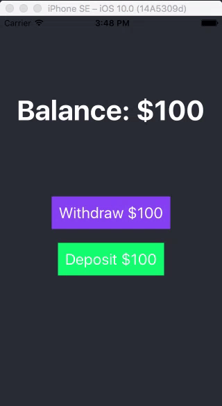
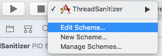
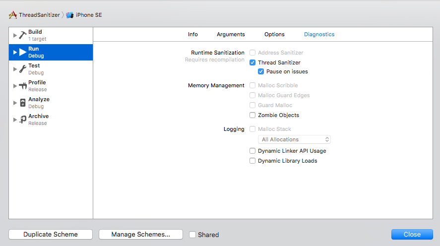
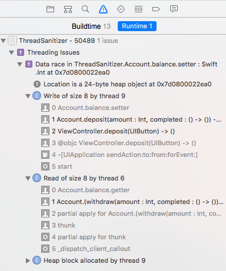
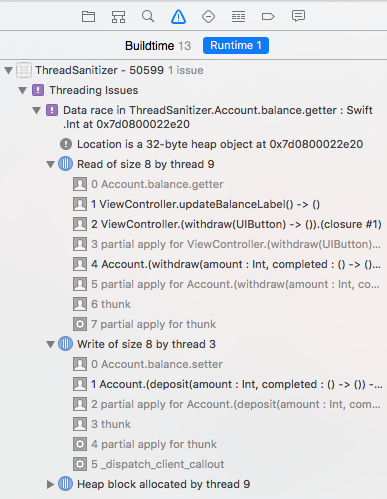

# iOS10 Day by Day

___

# Thread Sanitizer

Imagine your app is almost ready: it's beautifully polished and unit test coverage is very high. There's just one problem: there's a horrible bug which is only occurring intermittently and you've sunk hours into trying to fix it. What on earth could it be? Often these are due to multiple threads.

I'd hazard a guess that threading issues are the cause of many developer nightmares. They're notoriously difficult to track down as bug only occurs under certain conditions: so determining the root cause of the issue can be very tricky indeed.

Often the cause of this is what's known as a 'race condition'. We won't go into too much detail about what that means (// insert link to comprehensive article), but to quote the [ThreadSanitizer Manual from Google](https://github.com/google/sanitizers/wiki/ThreadSanitizerCppManual):

> A data race occurs when two threads access the same variable concurrently and at least one of the accesses is write.

These used to be an absolute nightmare to track down, but thankfully Xcode has shipped with a new debugging tool called the **Thread Sanitizer** which can help identify these issues before
you even notice them.

## The Project

We'll create a simple application which enables us to deposit and withdraw money in $100 denominations.

### The Account

Our `Account` model is pretty simple:

```swift
import Foundation

class Account {
    var balance: Int = 0

    func withdraw(amount: Int, completed: () -> ()) {
        let newBalance = self.balance - amount

        if newBalance < 0 {
            print("You don't have enough money to withdraw \(amount)")
            return
        }

        // Simulate processing of fraud checks
        sleep(2)

        self.balance = newBalance

        completed()
    }

    func deposit(amount: Int, completed: () -> ()) {
        let newBalance = self.balance + amount
        self.balance = newBalance

        completed()
    }
}
```

It contains just a couple of methods to enable us to withdraw and deposit funds into our account. The deposit and withdrawal amounts are hardcoded to being $100.

The `deposit` method executes almost instantly, however `withdraw` takes a little longer to complete. We'll say this is because we need to perform some fraud checks on the withdrawal, but really we'll just send the current thread to sleep for 2 seconds. This will give us an excuse to use some multithreading later on.

The only other thing to note is the completion block, which is executed when a deposit and withdrawal was successfully completed.

### View Controller

Our view controller consists of two buttons - for depositing and withdrawing - and a label to display the current balance. Here's the layout in the storyboard:

// Insert image of storyboard

To hook up our UI elements, we have an IBOutlet which references the balance label and a method that updates the label with the user's current balance.

```swift
import UIKit

class ViewController: UIViewController {

    @IBOutlet var balanceLabel: UILabel!

    let account = Account()

    override func viewDidLoad() {
        super.viewDidLoad()
        updateBalanceLabel()
    }

    @IBAction func withdraw(_ sender: UIButton) {
        self.account.withdraw(amount: 100, onSuccess: updateBalanceLabel)
    }

    @IBAction func deposit(_ sender: UIButton) {
        self.account.deposit(amount: 100, onSuccess: updateBalanceLabel)
    }

    func updateBalanceLabel() {
        balanceLabel.text = "Balance: $\(account.balance)"
    }
}
```

Let's give it a spin:


Hmmm... it's a bit slow when we try and withdraw our money! This is due to our `Account`'s `withdraw` method and its strict "fraud checking" which causes the main thread to block until the method has been completed. We want users to be able to repeatedly tap 'Deposit' and 'Withdraw' with minimal delay.

### Dispatch Queues to the rescue

It'd be great if we could move our blocking `withdraw` method off the main thread. We'll make use of the newly 'Swiftified' Grand Central Dispatch library:

```
func withdraw(amount: Int, onSuccess: () -> ()) {
    DispatchQueue(label: "com.shinobicontrols.balance-moderator").async {
        let newBalance = self.balance - amount

        if newBalance < 0 {
            print("You don't have enough money to withdraw \(amount)")
            return
        }

        // Simulate processing of fraud checks
        sleep(2)

        self.balance = newBalance

        DispatchQueue.main.async {
            onSuccess()
        }
    }
}
```

Let's run it again:



Hang on! Where's our money gone? We deposited $100 and withdrew $100 and yet we're left with 0, despite having started with $100!

We're confident our methods work as expected (because they're well unit-tested), it looks like dispatching our `withdraw` task onto a background queue is causing a problem.

### Thread Sanitizer comes to save our sanity!

Turning on the sanitizer is as simple as going to your target's scheme settings and checking the `Thread Sanitizer` box in the `Diagnostics` tab. We can choose to pause on issues encountered, which makes it easy to evaluate each problem on a case-by-case basis. We'll this on.





As the thread sanitizer only works at runtime, we'll need to recompile and re-run our application. Let's do that.

> In the WWDC presentation, Apple recommend turning on thread sanitizer in all your unit tests. The sanitizer operates at runtime and is only able to determine data races if the code is executed. If your code is well-covered by unit tests, then you may find the Thread Sanitizer finds most, if not all, of the race conditions in your project (you may find Xcode 7's code coverage tool we blogged about as part of iOS 9 Day by Day a useful read // Insert link to post)

> Something else worth noting is that it can only be run on Swift code written in version 3 of the language (Objective-C is compatible too) and can only be run using 64 bit simulators.

Now when we repeat our earlier process of withdrawing and then immediately depositing money, the thread sanitizer pauses the execution of our application as it discovers there's a race condition. It gives us a nice stack trace of where the conflicting access occur.



It also outputs results to the console, so you don't necessarily have to run the sanitizer from Xcode.

Looking though the stack traces and information provided, the Thread Analyzer helpfully indicates that we have a data race within our `Account.deposit` and `Account.withdraw` methods when accessing the `Account.balance` property. Oops, looks like we need to use the same serial dispatch queue in both the `withdraw` and `deposit` methods:

We'll modify our `Account` class to use a shared queue:

```swift
class Account {
    var balance: Int = 0
    private let queue = DispatchQueue(label: "com.shinobicontrols.balance-moderator")

    func withdraw(amount: Int, onSuccess: () -> ()) {
        queue.async {
            // Same as earlier...
        }
    }

    func deposit(amount: Int, onSuccess: () -> ()) {
        queue.async {
            let newBalance = self.balance + amount
            self.balance = newBalance

            DispatchQueue.main.async {
                onSuccess()
            }
        }
    }
}
```

Running the application again shows we still have a data race, however it's no longer within our `Account` class, it's instead caused by our `ViewController` accessing the `balance` from the main thread.



We can protect our `balance` property by converting it to a private variable only accessible within `Account`, and instead use our queue to return the balance.

```
private var _balance: Int = 0
var balance: Int {
    return queue.sync {
        return _balance
    }
}
```

We'll need to convert any writing to the `balance` variable to now use the private `_balance` property instead.

Now when we run our application, we should be able to repeatedly tap 'withdraw' and 'deposit' without troubling the Thread Sanitizer. Great - we've just used this new tool to fix bugs in our code.

## Further Reading

Although it may not seem like it at first, the Thread Sanitizer will likely become a very important tool in the iOS developer's toolbox. Its ability to find data races even if they did not occur during the running of the program is likely to save countless numbers of hours debugging threading issues that manifest only intermittently.

As always, Apple's [WWDC talk](https://developer.apple.com/videos/play/wwdc2016/412/) is very informative and well worth a watch. The sanitizer is a part of the Clang compiler and more detailed information can be found on the [LLVM website](http://clang.llvm.org/docs/ThreadSanitizer.html) and the team at Google who built the sanitizer have a number of interesting wiki pages, including one that gives a high-level walkthrough of the [algorithm used to detect threading issues](https://github.com/google/sanitizers/wiki/ThreadSanitizerAboutRaces).

> We used a little of the new-look GCD available to us in Swift 3. Apple also spoke about this in the ["Concurrent Programming With GCD in Swift 3" talk](https://developer.apple.com/videos/play/wwdc2016/720/) which you may find useful. Additionally, Roy Marmelstein wrote a nice, succinct post about the changes [here](https://medium.com/swift-and-ios-writing/a-quick-look-at-gcd-and-swift-3-732bef6e1838#.1byavgsts).
