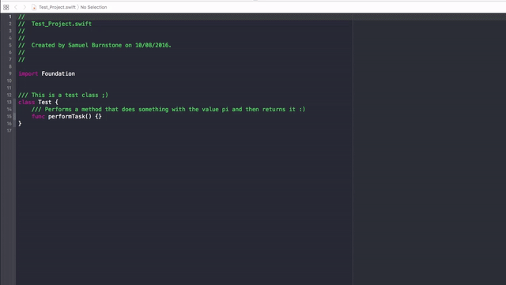
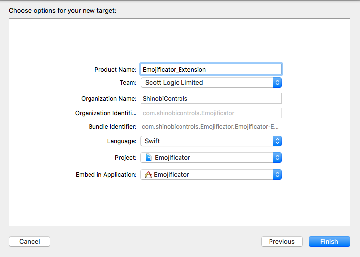
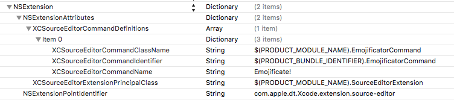
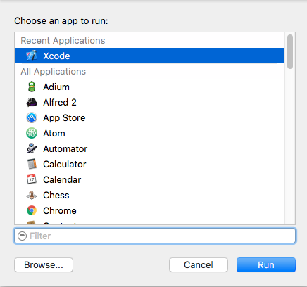

# Xcode Source Editor Extensions

---

## Introduction

Love it or hate it, Xcode is a major part of developing for Apple's platforms (I'm mostly in the 'love it' camp... the majority of the time, anyway!). One gripe of many developers has been its lack of support for plug-ins. These extend the built-in functionality by allowing developers to add their own features such as performing spell-checking or converting all `UIColor` variables to using the new Color Literals.

As Xcode didn't have this capability, [Alcatraz](http://alcatraz.io) filled the void to become the de-facto plugin manager. Whilst they filled the role as best they could, Xcode didn't make it easy and plug-ins had to use slightly dirty tricks to hook in to it. Due to security and stability concerns these plugins no longer function as of Xcode 8. Thankfully, Apple have added first-class support for extending Xcode's functionality with new Source Editor Extensions.

## The Project

We'll take a look at building our own extension that replaces ASCII characters with their Emoji equivalents. For example "That's a nice thing to say :)" will be converted to "That's a nice thing to say 😀". As always, the code is available on Github should you wish to take a look. Here's a sneak peak:



Like we saw in [Day 1](https://www.shinobicontrols.com/blog/ios-10-day-by-day-day-1-messages) when creating an iMessage App, Apple is heavily utilizing its Extensions infrastructure and Xcode Extensions are no different. You can ship an entire app with the extensions included (via the Mac App Store, for example) or sign and distribute the extension yourself. At first, an entire application for a few extensions may seem like overkill, however it serves as a handy location for configuration options; Xcode provides no UI apart from a menu item to run a command.

To get started, we'll create a new macOS project, naming it `Emojificate`. For the purposes of this post we can ignore the files related to the Mac App, as we're purely going to focus on the extension side of things.

We'll need to add a new target for our Xcode Extension and the new `Xcode Extension` option will set us up nicely. We need to give this a unique name, in my case I've named it `Emojificator_Extension`.



Xcode will set us up with everything we need to get going.

### Info.plist

To alter the displayed name of the extension, set the `Bundle name` key to the name of your choice - I went for `Emojificator`.


As with other Extensions, you define attributes of your extension here, such as: the extension type (`Xcode.extension.source-editor`); the principal class in your extension, conforming to `XCSourceEditorExtension` (in our case this will be `SourceEditorExtension`); and the commands we want users of our extension to be able to execute.

Your extension can contain any number of commands and will appear in the order specified within the plist. In our case we have just a single command, defined within the class `EmojificatorCommand` which conforms to the `XCSourceEditorCommand` protocol, we inform Xcode of the class that will perform this command using the `XCSourceEditorCommandClassName` key.

The class executing your command is not limited to being called from a single command, rather multiple commands can be handled by the same class. This is handy if commands are similar in functionality and you'd like to share code between them. However, to distinguish between commands you can use the `XCSourceEditorCommandIdentifier` key.

Finally, the simplest of the lot, is the name of the command. In our case we set this to "*Emojificate!"* as the value of the `XCSourceEditorCommandName` key.



### SourceEditorExtension.swift

This is the entry point for the extension and the class must conform to the `XCSourceEditorExtension` protocol. As we've set up our commands in the plist, we don't actually have to do anything here. If you wish, you can do some initial set up within the optional method `extensionDidFinishLaunching`.

> Xcode launches your extension at start up, way before a command is actually invoked. This is done to make executing a command as instantaneous as possible.

If your commands can be dynamically generated, such as in response to some user configuration within the main Mac application, you can override the commands defined within the plist. For example. the equivalent of our command:

```
var commandDefinitions: [[XCSourceEditorCommandDefinitionKey: AnyObject]] {
    // If your extension needs to return a collection of command definitions that differs from those in its Info.plist, implement this optional property getter.
    return [[
        .classNameKey : "Emojificator_Extension.EmojificateCommand",
        .identifierKey : "com.shinobicontrols.Emojificator_Extension.EmojificateCommand",
        .nameKey : "Emojificate!"
    ]]
}
```

### EmojificatorCommand.swift

By default, Xcode will create a class named `SourceEditorCommand`, however I've renamed it to the slightly more descriptive `EmojificateCommand`. This is where the logic for our command will reside. It must conform to the `XCSourceEditorCommand` protocol.

```swift
import Foundation
import XcodeKit

class EmojificateCommand: NSObject, XCSourceEditorCommand {
}
```

For this example, we'll define the mapping between the ASCII smileys and their Emoji counterparts. We'll just pick a selection of them:

```swift
let asciiToEmojiMap = [
        ":)" : "😀",
        ";)" : "😉",
        ":(" : "☹️"]
```

To replace the ASCII items with Emoji, we need two methods:

```swift
extension EmojificateCommand {

    /// Returns whether the string contains an item that can be converted into emoji
    func replaceableItemsExist(in string: String) -> Bool {
        for asciiItem in asciiToEmojiMap.keys {
            if string.contains(asciiItem) {
                return true
            }
        }
        return false
    }

    /// Replaces any ASCII items with their emoji counterparts and returns the newly 'emojified' string
    func replaceASCIIWithEmoji(in string: String) -> String {
        var line = string
        for asciiItem in asciiToEmojiMap.keys {
            line = line.replacingOccurrences(of: asciiItem, with: asciiToEmojiMap[asciiItem]!)
        }
        return line
    }
}
```

Finally, we need to implement the `perform(with: completionHandler:)` method which will be invoked when the command is executed from within Xcode.

```swift
func perform(with invocation: XCSourceEditorCommandInvocation, completionHandler: (Error?) -> Void) {
    let lines = invocation.buffer.lines

    for (index, line) in lines.enumerated() {
       if let line = line as? String,
           replaceableItemsExist(in: line) {
           lines[index] = replaceASCIIWithEmoji(in: line)
       }
    }

    // Command must perform completion to signify it has completed
    completionHandler(nil)
}
```

The `invocation` object contains an instance of `XCSourceTextBuffer`, which describes the contents of the file the command has been invoked on, such as whether it's a Swift file or an Objective-C header and the number of spaces represented by a tab. We're interested in modifying the text contents of the buffer. We could use `completeBuffer` which is a string representation of the buffer or the `lines` mutable array. Apple recommends modifying the contents of the array if your command is simply altering a few characters here and there, as it's more performant due to Xcode being able to track just the changed contents of the buffer.

To inform Xcode that the command has finished executing, we call the completion handler.

> Xcode Extensions are run in a separate process to Xcode. This is great news, as it means slow running commands should not result in any noticeable slowdown in Xcode's performance. One thing to note is Xcode is quite strict in how long your command has to execute. If it has not completed within a few seconds, your execution will be "named and shamed" and the user has the option to cancel the command.

### Running the "Emojificate" command

Here's a bit of Xcode-ception for you: to test our command, we'll run our extension in a test version of Xcode. The test version icon is a gray color which helps to differentiate it from our development version.




Here's the command in action:


## Further Reading

The groundwork is certainly there for a rich ecosystem of extensions that could greatly enhance developer productivity. The commands are limited to modifying the buffer on a per-file basis and are sandboxed by default, although you can request further entitlements if you so need. From what [I've read](https://github.com/alcatraz/Alcatraz/issues/475) it sounds like the Xcode engineers are looking to make source editor extensions more powerful in the future, so if you're unable to accomplish your specific goal, it's probably worth submitting a radar to Apple outlining your use case.

As ever, the [WWDC video](https://developer.apple.com/videos/play/wwdc2016/414/) provides an excellent introduction.
