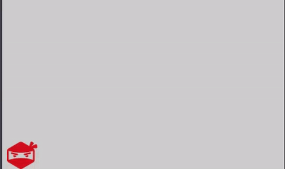
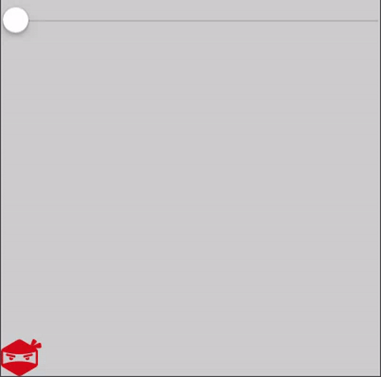
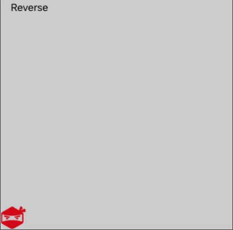
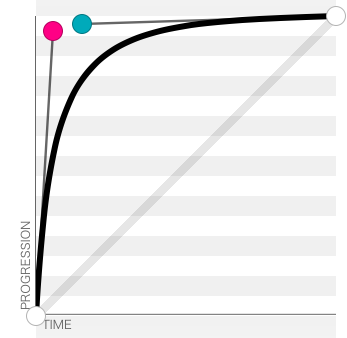
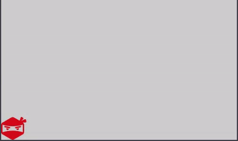

# UIViewPropertyAnimator

## Back in the Dark Ages
The block based UIView animations make adding transitions between animatable properties (frame, transform, e.t.c) a breeze to set up. They're incredibly easy to create requiring only a few lines of code:

```
view.alpha = 1

UIView.animate(withDuration: 2) {
    containerView.alpha = 0
}
```

You can also add completion blocks that will be executed when the animation finishes and adjust the animation curve if the default linear motion doesn't work for you.

However, what happens if you need to create your own custom animation curve, which requires the property being animated to start rapidly and then quickly slow down? Another slightly tricky issue is the case where you need to cancel an in-progress animation. Whilst these could be worked around, by either using third-party libraries or [creating a new animation to replace the one currently in-progress](http://stackoverflow.com/questions/15693795/how-to-interrupt-uiview-animation-before-completion), Apple has added a new component to the UIKit framework which makes this a whole lot easier: enter the `UIViewPropertyAnimator`.

## A new era of animation

The `UIViewPropertyAnimator` is a well-written and highly-extensible API. It covers a lot of the same functionality as the 'old-style' UIView animations, but gives you fine-grained programmatic control over the animation. This means you can pause an in-progress animation, restart it at a later date if you wish and even dynamically modify the animatable properties (such as changing the animation's end point to the top-right of the screen when it was previously the bottom-left).

To explore this new class, we'll go through a few examples where we animate an image across the screen. As with all the Day by Day blog posts, the code is available on Github - this time we're going to use a Playground.

## Playground Walkthrough

All our Playground pages will animate a ninja across the screen. To make the pages as relevant as possible, we'll hide our common code in the `Sources` folder. Not only does this help declutter each page's code, it also helps them run faster as the source is precompiled.

The source contains a simple `UIView` subclass, named `NinjaContainerView`. This simply sets up the view with a `UIImageView` subview that will display our ninja. I added the image to the `Resources` group in the Playground.

```swift
import UIKit

public class NinjaContainerView: UIView {

    public let ninja: UIImageView = {
        let image = UIImage(named: "ninja")
        let view = UIImageView(image: image)
        view.frame = CGRect(x: 0, y: 0, width: 45, height: 39)
        return view
    }()

    public override init(frame: CGRect) {
        // Animating view
        super.init(frame: frame)

        // Position ninja in the bottom left of the view
        ninja.center = {
            let x = (frame.minX + ninja.frame.width / 2)
            let y = (frame.maxY - ninja.frame.height / 2)
            return CGPoint(x: x, y: y)
        }()

        // Add image to the container
        addSubview(ninja)
        backgroundColor = #colorLiteral(red: 0.8039215803, green: 0.8039215803, blue: 0.8039215803, alpha: 1)
    }

    required public init?(coder aDecoder: NSCoder) {
        fatalError("init(coder:) has not been implemented")
    }

    /// Moves the ninja view to the bottom right of its container, positioned just inside.
    public func moveNinjaToBottomRight() {
        ninja.center = {
            let x = (frame.maxX - ninja.frame.width / 2)
            let y = (frame.maxY - ninja.frame.height / 2)
            return CGPoint(x: x, y: y)
        }()
    }
}
```

Now within each Playground page we can copy and paste the following:

```swift
import UIKit
import PlaygroundSupport

// Container for our animating view
let containerView = NinjaContainerView(frame: CGRect(x: 0, y: 0, width: 400, height: 400))

let ninja = containerView.ninja

// Show the container view in the Assistant Editor
PlaygroundPage.current.liveView = containerView
```

This will use the Playground useful 'Live View' feature to give us a visual demonstration of our animations without having to boot up the simulator. They still have their quirks, but Playgrounds are brilliant for trying new things out.

To display the Live View pane, navigate to View -> Assistant Editor -> Show Assistant Editor or, alternatively, select the icon that looks like two intersecting circles in the top-right toolbar. If you don't see a live view in the Assistant Editor make sure Timeline is selected, rather than Manual - I lost more time than I care to admit to this!

## Starting Simple

We can use `UIViewPropertyAnimator` in exactly the same way as the old-style block-based API:

```swift
UIViewPropertyAnimator(duration: 1, curve: .easeInOut) {
    containerView.moveNinjaToBottomRight()
}.startAnimation()
```

This kicks off an animation lasting 1 second with a time curve that eases in then out. The animation performed is within the closure.


Note how we have to explicitly kick-off the animation by calling `startAnimation()`. An alternative way to create an animator without having to start it yourself is using `runningPropertyAnimator(withDuration:delay:options:animations:completion:)` - a fair mouthful, so you may prefer to use the manual-start version.

It's easy to add extra animations after the animator has been created.

```swift
// Now we've set up our view, let's animate it with a simple animation
let animator = UIViewPropertyAnimator(duration: 1, curve: .easeInOut)

// Add our first animation block
animator.addAnimations {
    containerView.moveNinjaToBottomRight()
}

// Now here goes our second
animator.addAnimations {
    ninja.alpha = 0
}
```

These animation blocks will be run alongside each other.



Completion blocks can be added in a similar manner:

```swift
animator.addCompletion {
    _ in
    print("Animation completed")
}

animator.addCompletion {
    position in
    switch position {
    case .end: print("Completion handler called at end of animation")
    case .current: print("Completion handler called mid-way through animation")
    case .start: print("Completion handler called  at start of animation")
    }
}
```

In the case where the animation is allowed to run for its entire duration, we'll see the following printed:

```
Animation completed
Completion handler called at end of animation
```

## Scrubbing and Reversing

We can use the animator to scrub through our animation:

```swift
let animator = UIViewPropertyAnimator(duration: 5, curve: .easeIn)

// Add our first animation block
animator.addAnimations {
    containerView.moveNinjaToBottomRight()
}

let scrubber = UISlider(frame: CGRect(x: 0, y: 0, width: containerView.frame.width, height: 50))
containerView.addSubview(scrubber)

let eventListener = EventListener()
eventListener.eventFired = {
    animator.fractionComplete = CGFloat(scrubber.value)
}

scrubber.addTarget(eventListener, action: #selector(EventListener.handleEvent), for: .valueChanged)
```



> Playgrounds are great and you can even add interactive UI elements to Live Views. Unfortunately, receiving events is a little painful as we need a class that conforms to `NSObject` so we can listen for events like `.valueChanged`. To do this we use a simple object `EventHandler` which calls our `eventFired` closure when its `handleEvent` method is called.

The fraction value has nothing to do with time, so we don't see our ninja moving in a graceful `easeIn` curve like we defined.

The power of the property animator really comes from the ability to interrupt its in-progress animations. We can reverse the animation by simple toggling the `isReversed` property.

To demonstrate this we'll use keyframe animations so we can define a multi-stage animation:

```swift
animator.addAnimations {
    UIView.animateKeyframes(withDuration: animationDuration, delay: 0, options: [.calculationModeCubic], animations: {
        UIView.addKeyframe(withRelativeStartTime: 0,  relativeDuration: 0.5) {
            ninja.center = containerView.center
        }
        UIView.addKeyframe(withRelativeStartTime: 0.5, relativeDuration: 0.5) {
            containerView.moveNinjaToBottomRight()
        }
    })
}

let button = UIButton(frame: CGRect(origin: .zero, size: CGSize(width: 100, height: 30)))
button.setTitle("Reverse", for: .normal)
button.setTitleColor(.black(), for: .normal)
button.setTitleColor(.gray(), for: .highlighted)
let listener = EventListener()
listener.eventFired = {
    animator.isReversed = true
}

button.addTarget(listener, action: #selector(EventListener.handleEvent), for: .touchUpInside)
containerView.addSubview(button)

animator.startAnimation()
```

When the button is pressed the property animator will reverse the animation, if its state is active (i.e. the animation is currently in-progress and the ninja has not yet reached its final destination).



## Adding your own Time Curves

The property animator is beautifully simple, whilst remaining pretty extensible. If you require an alternative animation curve to those provided by Apple, you can pass in your own instance conforming to the `UITimingCurveProvider` protocol. In most cases you will probably be able to use either `UICubicTimingParameters` or `UISpringTimingParameters`.

Let's say our ninja accelerates really quickly and then comes to a gradual stop shortly into their trip across the screen. We'll use a bezier curve like the one below (drawn using this [handy online tool](http://cubic-bezier.com)).



```swift
let bezierParams = UICubicTimingParameters(controlPoint1: CGPoint(x: 0.05, y: 0.95),
                                                   controlPoint2: CGPoint(x: 0.15, y: 0.95))

let animator = UIViewPropertyAnimator(duration: 4, timingParameters:bezierParams)

animator.addAnimations {
    containerView.moveNinjaToBottomRight()
}

animator.startAnimation()
```


## Further Reading

The new property animator looks like it'll make animating items easier than ever before by bringing existing capabilities under a consistent API, adding the ability to interrupt animations and add your own custom timing curves.

Apple provides some excellent [documentation](https://developer.apple.com/reference/uikit/uiviewpropertyanimator) for the `UIViewPropertyAnimator`. Alternatively, you could watch the [WWDC presentation](https://developer.apple.com/videos/play/wwdc2016/216/) which takes an in-depth look at the new API and delves into how it could be used to create custom transitions between `UIViewController`s. Other interesting demonstrations include [simple games](https://github.com/JakeLin/SaveTheDot).
