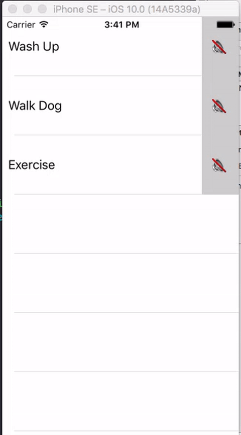
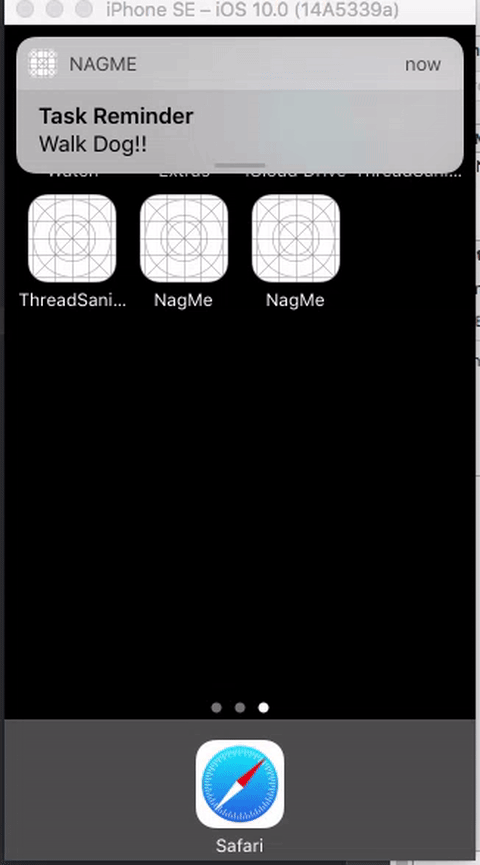
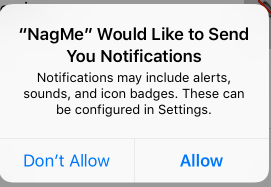

User Notifications Framework

## Introduction

Developers have been able to schedule notifications on iOS for a long time, but previous APIs lacked the fine-grained control you might have wanted. Fortunately, Apple have addressed this in iOS 10 and released the new `UserNotifications` framework. This provides you with a far richer API and simpler scheduling for both local and remote notifications.

> A local notification is one that is scheduled by your application, e.g. a reminder to take your lunch into work. A remote notification is usually triggered by a server and passed to Apple's APNS service which handles the pushing of the notification to the users' devices, e.g. to broadcast to your users that a new version of your App is out.

## The Project

> This project was developer using Xcode 8 Beta 6

To take a look at the new `User Notifications` framework, we'll build a simple app which allows users to schedule an alert for a task they need to do. The notification will be displayed every 60 seconds and will repeat until the user cancels the reminder. As always, the code is available on [Github](https://github.com/shinobicontrols/iOS10-day-by-day/tree/master/05%20-%20User%20Notifications).

A loudspeaker indicates a notification is currently scheduled whilst a loudspeaker with a line through it indicates no notification exists for that task.



We'll add the ability for the user to respond from the notification itself:



### The UI

Our application is just a simple tableview that displays a list of task the user may want to be reminded about. Other than a simple custom cell, there's not much more to it than that.

The tasks are defined like so within our `NagMeTableViewController`:

```swift
class NagMeTableViewController: UITableViewController {
  typealias Task = String

  let tasks: [Task] = [
      "Wash Up",
      "Walk Dog",
      "Exercise"
  ]
  // Rest of class
```

Our table view is populated with the tasks and each cell is setup to call a closure when the mute/unmute button is toggled.

```swift
// Rest of NagMeTableViewController
  override func tableView(_ tableView: UITableView, cellForRowAt indexPath: IndexPath) -> UITableViewCell {
    let cell = tableView.dequeueReusableCell(withIdentifier: "TaskCell", for: indexPath) as! TaskCell

    let task = tasks[indexPath.row]

    cell.nameLabel.text = task

    // Set the cell's icon to indicate whether notification exists or not
    retrieveNotification(for: task) {
        request in
        request != nil ? cell.showReminderOnIcon() : cell.showReminderOffIcon()
    }

    // Closure invoked when button tapped
    cell.onButtonSelection = {
        [unowned self] in
        self.toggleReminder(for: task)
    }

    return cell
  }

  override func tableView(_ tableView: UITableView, numberOfRowsInSection section: Int) -> Int {
      return tasks.count
  }
}
```
To determine if the user is currently being 'nagged' about a task, we call `retrieveNotification(for: task)` which we'll define later. If a notification object exists then we know the user has requested to be notified about the task.

When the cell's button is tapped, we'll call another method we're yet to implement called `toggleReminder(for: task)`. This is where the magic will happen to schedule our notifications.

### Requesting Authorization

Before we can schedule notifications, we need to request permission from the user to show notifications. We'll do this when the app launches:

```swift
func application(_ application: UIApplication, didFinishLaunchingWithOptions launchOptions: [UIApplicationLaunchOptionsKey: Any]?) -> Bool {
  UNUserNotificationCenter.current().requestAuthorization(options: [.sound, .alert]) {
    granted, error in
    if granted {
      print("Approval granted to send notifications")
    }
  }
}
```
This results in an alert being displayed to the user asking if they'll grant our application permission to send notifications. The closure parameter `granted` indicates whether we were granted permission at this time. The alert is only displayed to the user once, but if they later decide to alter their notification settings, they can do this within the Settings app.



You'll notice that a lot of the `User Notification` framework's API take a completion block. This is because requests to your application's `UNUserNotificationCenter` are executed asynchronously on a background thread. Calling `current()` results in the framework returning the notification center object for our app. All our scheduling and removing of notifications will be done via this singleton instance.

### Creating Notifications

It's a bit of a mouthful to create and add the notification, so we'll break the function down and walk through it:

```swift
/// Creates a notification for the given task, repeated every minute.
func createReminderNotification(for task: Task) {
  // Configure our notification's content
  let content = UNMutableNotificationContent()
  content.title = "Task Reminder"
  content.body = "\(task)!!"
  content.sound = UNNotificationSound.default()
  content.categoryIdentifier = Identifiers.reminderCategory
```
To configure the appearance of the notification, we use an instance of `UNMutableNotificationContent`. We set the title and content to be displayed to the user in our banner. Additionally, we specify that when the notification appears, the default notification sound should play, however you can specify a custom sound should you wish.

Finally, we set a `categoryIdentifier` which will come in handy later when we want to attach custom actions to our notification.

```swift
  // We want the notification to nag us every 60 seconds (the minimum time-interval Apple allows us to repeat at)
  let trigger = UNTimeIntervalNotificationTrigger(timeInterval: 60, repeats: true)
```
A trigger is used by the notification center to decide when it's time to show the alert. If no trigger is supplied, then the notification is delivered immediately.

There are a few different types of trigger:

  - `UNTimeIntervalNotificationTrigger` : Enables notification to be sent after the specified time interval. Can repeat the time interval if required.
  - `UNCalendarNotificationTrigger` : Notifies user using date components e.g. trigger at 8am. It can also be repeated.
  - `UNLocationNotificationTrigger` : Adds ability to trigger when the user enters or exits a particular location.

We use `UNTimeIntervalNotificationTrigger` for our purposes and set it to repeat every minute.

```swift
  let identifier = "\(task)"
```
Our application allows the user to schedule notifications for each task in the `tasks` array. The `identifier` allows us to (you guessed it) identify which task our scheduled notification is associated with.

```swift
  // Construct the request with the above components
  let request = UNNotificationRequest(identifier: identifier, content: content, trigger: trigger)
```
Using all the components above, we create our `UNNotificationRequest` object which encapsulates all information required for our notification. We'll then pass this to the notification center for scheduling:

```swift
  UNUserNotificationCenter.current().add(request) {
    error in
    if let error = error {
      print("Problem adding notification: \(error.localizedDescription)")
    }
    else {
      // Set icon
      DispatchQueue.main.async {
        if let cell = self.cell(for: task) {
            cell.showReminderOnIcon()
        }
      }
    }
  }
}
```
If the notification was added without any problems, we update the cell displaying the task to show the icon that indicates the reminder is on. Note that we need to switch back to the main thread to make changes to our UI. This is because the completion block is called on a background thread.

### Retrieving Notifications

We used a helper function earlier to retrieve an existing notification. The new notifications API makes this extremely simple to do:

```swift
func retrieveNotification(for task: Task, completion: @escaping (UNNotificationRequest?) -> ()) {
  UNUserNotificationCenter.current().getPendingNotificationRequests {
    requests in
    DispatchQueue.main.async {
      let request = requests.filter { $0.identifier == task }.first
      completion(request)
    }
  }
}
```

As with the previous completion handler, we need to switch back to the main thread.

### Hooking up our Notifications

When configuring each table view cell to display, we were calling a `toggleReminder` function to create or remove a notification for the task that was just tapped. We'll implement this now:

```swift
func toggleReminder(for task: Task) {
  retrieveNotification(for: task) {
    request in
    guard request != nil else {
        // Notification doesn't exist, therefore schedule it
        self.createReminderNotification(for: task)
        return
    }

    // Remove notification
    UNUserNotificationCenter.current().removePendingNotificationRequests(withIdentifiers: [task])

    // Now we've muted the notification, let's set the cell's icon to reflect that.
    if let cell = self.cell(for: task) {
        cell.showReminderOffIcon()
    }
  }
}
```

We schedule a notification if `request` is nil, as that must mean a notification doesn't currently exist. Otherwise, we remove the pending notification by passing the notification center the task's identifier (e.g. 'Exercise' or 'Walk Dog') and update the icon to display the notification has been 'muted'.

Nice work! We now have a notification that buzzes every 60 seconds until the user turns it off by navigating to our application and finding the task.

However, it'd be great if we could give the user the opportunity to cancel the repeating notification from the notification itself...

### Adding Actions

We can add this ability by using 'notification actions'. These allow users to swipe down on a notification banner, or swipe left on the notification in the lock screen to reveal these actions.

You can add up to four actions (although, on some devices Apple says only the first two may be displayed due to screen-size constraints) and each action is encompassed in a 'category'.

```swift
func addCategory() {
  // Add action
  let cancelAction = UNNotificationAction(identifier: Identifiers.cancelAction,
                                          title: "Cancel",
                                          options: [.foreground])

  // Create category
  let category = UNNotificationCategory(identifier: Identifiers.reminderCategory,
                                        actions: [cancelAction],
                                        intentIdentifiers: [],
                                        options: [])

  UNUserNotificationCenter.current().setNotificationCategories([category])
}
```
We define our action as requiring the application to open when the action is tapped using the `.foreground` `UNNotificationActionOptions`. Additional options enable you to indicate an action is destructive or requires unlocking before being performed. We'll call `addCategory()` within `application(_:didFinishLaunchingWithOptions:)`.

The `identifier`s are simple strings, which can result in notifications not working as you'd expect due to typos. I had one defined as "cancel" and another as "Cancel", which took a while to track down and led me to create a simple struct where all identifiers could reside:

```swift
struct Identifiers {
    static let reminderCategory = "reminder"
    static let cancelAction = "cancel"
}
```

To be notified when an action was tapped, we need to conform to the `UNUserNotificationCenterDelegate` protocol. To keep things as simple as possible, we'll just make our `AppDelegate` the delegate and we'll assign it within `application(_:didFinishLaunchingWithOptions:)`:

```
UNUserNotificationCenter.current().delegate = self
```

Now we can implement our action handlers:

```swift
public func userNotificationCenter(_ center: UNUserNotificationCenter,
                                       didReceive response: UNNotificationResponse,
                                       withCompletionHandler completionHandler: @escaping () -> Void) {
  if response.actionIdentifier == Identifiers.cancelAction {
      let request = response.notification.request
      print("Removing item with identifier \(request.identifier)")
      UNUserNotificationCenter.current().removePendingNotificationRequests(withIdentifiers: [request.identifier])
  }

  completionHandler()
}
```
We check that the reason this delegate method was called was due to the user selecting the action button (it's also called when the user taps directly on the notification which we don't want to act on). If it was, then we just remove the notification using the identifier.

Finally, we need to call `completionHandler` to signify to the system that we've finished handling the response and it can carry on its merry way.


> Note: In Beta 6 there's a bug with autocompletion for the above delegate method. If you get a warning saying something like **Instance method 'userNotificationCenter(_:didReceive:withCompletionHandler:)' nearly matches optional requirement 'userNotificationCenter(_:didReceive:withCompletionHandler:)' of protocol 'UNUserNotificationCenterDelegate'** you should go to the delegate's generated interface and copy the method from there. The autocompletion appears to miss off the `@escaping` annotation for the completion handler.

So, we're almost there. But what about showing our notification when the app is in the foreground? If we leave our project as it is, the notification will be silenced by the system. Let's fix that quickly.

### Receiving Notifications when App is in Foreground

This is a welcome addition in iOS 10: you can now choose to display the notification when your app is in the foreground. To do this, it's as simple as implementing one more delegate method and adding one line of code:

```swift
func userNotificationCenter(_ center: UNUserNotificationCenter,
                                willPresent notification: UNNotification,
                                withCompletionHandler completionHandler: @escaping (UNNotificationPresentationOptions) -> Void) {
  completionHandler(.alert)
}
```
In this case, we just tell the system that the notification should be displayed as an alert.

## Further Reading

I hope that gives a good introduction to the power of scheduling local notifications with the new `User Notifications` framework. It looks like Apple have listened to the problems developers have had and come up with a pretty comprehensive API.

Although we haven't looked into handling remote notifications, the new framework should help there too as it brings local and remote notifications under the same API, thereby reducing code duplication.

To learn more, you can watch the [Introduction to Notifications](https://developer.apple.com/videos/play/wwdc2016/707/) from WWDC 2016. Again, feel free to have a poke around the sample project on [Github](https://github.com/shinobicontrols/iOS10-day-by-day/tree/master/05%20-%20User%20Notifications).
