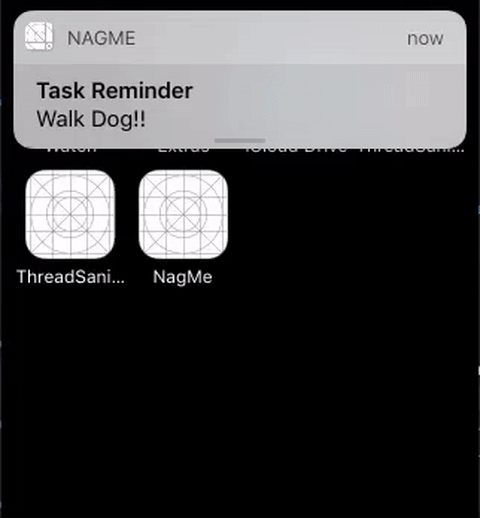
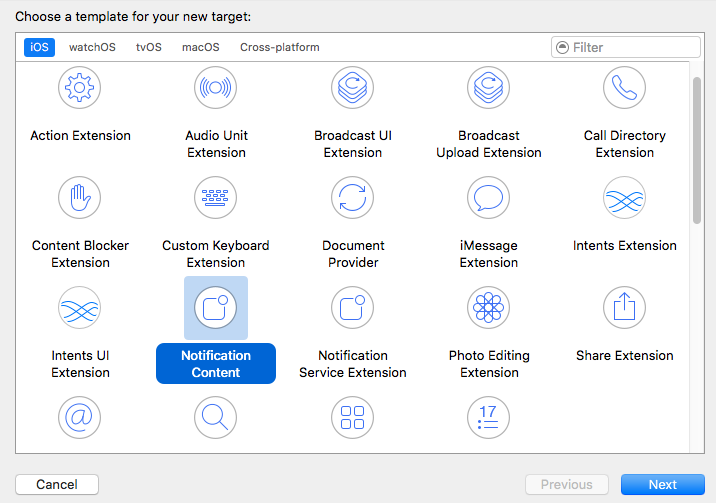
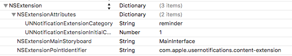
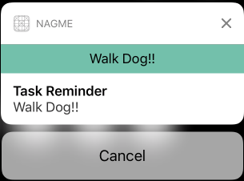
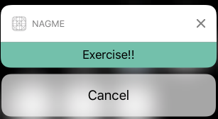
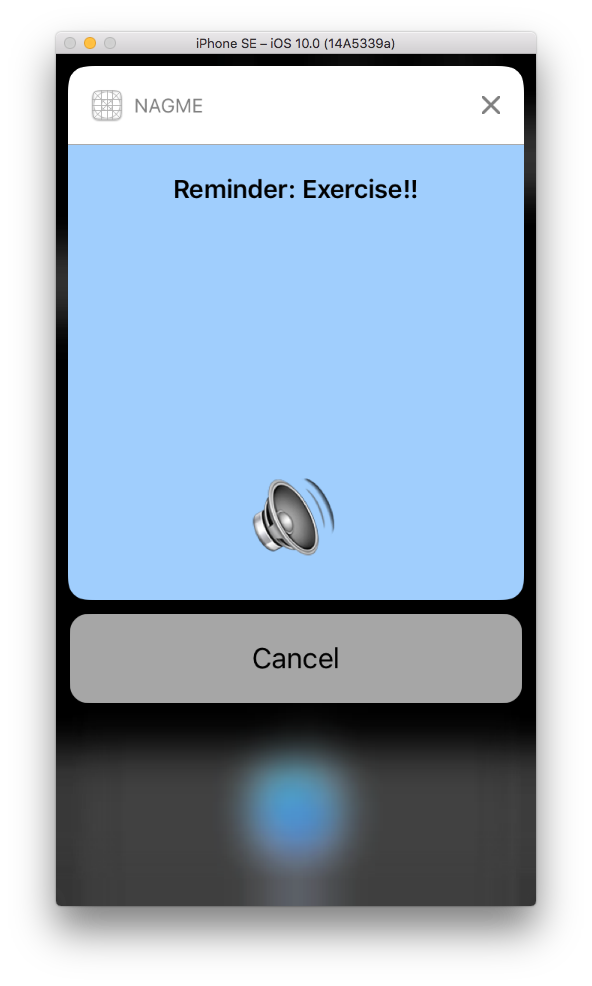
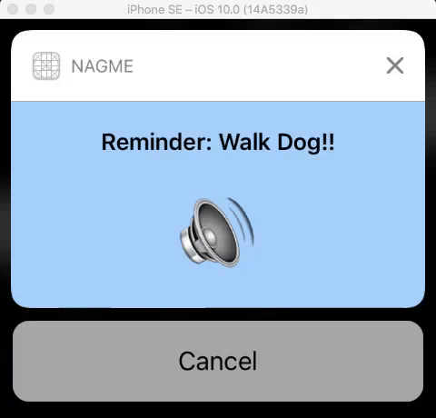

# Content Extensions - iOS 10 Day by Day :: Day 6

## Introduction

We took a look at the new `UserNotifications` framework in [day 5](https://www.shinobicontrols.com/blog/ios-10-day-by-day-day-5-user-notifications). This gives us a unified API for both local and remote notifications, along with some new methods to gain more control over our pending and delivered notifications.

That was great, but Apple has taken notifications another step further by giving developers the ability to customize the appearance of the notifications when a user wishes to view the 'expanded' notification. This functionality is enabled if you include a separate framework called `UserNotificationsUI`. It has an extremely simple API,  containing just a single public protocol: [`UNNotificationContentExtension`](https://developer.apple.com/reference/usernotificationsui/unnotificationcontentextension).

## The Project

We'll build upon our *NagMe* application we built last week by adding a jazzy custom UI to the *reminder* notification that. This will allow the user to cancel the reminder from the notification without being kicked out to the main application. Here's a sneak preview of what we'll build:



As with all the Day by Day blog posts, you can find the project's source code on [Github](https://github.com/shinobicontrols/iOS10-day-by-day/tree/master/06%20-%20Notification%20Content%20Extensions).

### Creating the Extension

Many of the flagship iOS 10 features are built upon Apple's Extensions infrastructure. We saw this when building the [Xcode Source Editor](https://www.shinobicontrols.com/blog/ios-10-day-by-day-day-3-xcode-source-editor-extensions) and [Messages](https://www.shinobicontrols.com/blog/ios-10-day-by-day-day-1-messages) extensions. Extending the notification's functionality is also done in the same manner.

To get started we need to add a new target to our *NagMe* project. When presented with a choice of templates, we want to choose *Notification Content*. You can name it whatever you like, I chose *NagMeContentExtension*.



You'll notice that aside from the usual `Info.plist`, the content extension also includes two other files:

- `MainInterface.storyboard` : we'll design our notification UI in this
- `NotificationViewController.swift` : a UIViewController subclass that will enable us to update our custom interface.

### Associating the Extension with our Notification Category

Now we're all set up, we need to let the system know which notification category the UI should be displayed for. If you remember in the [previous post](https://www.shinobicontrols.com/blog/ios-10-day-by-day-day-5-user-notifications), a category is a fairly simple object (see [UNNotificationCategory](https://developer.apple.com/reference/usernotifications/unnotificationcategory)) that defines the type of notifications your app supports and any associated actions which appear as buttons below the notification when expanded.

To do this, we need to open up our extension's `Info.plist`, find the `NSExtensionAttributes` dictionary and alter the value of the `UNNotificationExtensionCategory` key to be the same as our category name ("reminder"). Note, that this can either be a string or an array of strings if you want multiple notification categories to use the same content extension.



Now if we build and run, we should see something a little more exciting than the default notification content.



That worked! It's using the default design in the extensions `MainInterface.storyboard` and the boilerplate code in `NotificationViewController` to update the text label. But there are a couple of things we'd like to refine. First of all, we're duplicating the notification content in both our UI and the *DefaultContent* section. Let's get rid of that!

### Removing the Default Content

This is as simple as modifying the `Info.plist` by adding a new key under our extension attributes: `UNNotificationExtensionDefaultContentHidden`. Set this to `YES` to prevent the default content section from appearing.



Let's move on to creating our custom interface.

### Custom UI

We'll switch over to `MainInterface.storyboard` and add our UI elements. This will consist of a label describing the task we're being nagged about and a speaker icon. Once that's done, we just need to add IBOutlets to these elements and we're done here!

When we receive a notification we want to update the label's text and shake the speaker label - a crude way to catch the user's attention. To do this we'll need to alter our `NotificationViewController`. The method we'll use is defined in the `UNNotificationContentExtension` protocol which our view controller conforms to:

```swift
func didReceive(_ notification: UNNotification) {
  label.text = "Reminder: \(notification.request.content.body)"
  speakerLabel.shake() // See sample code for the implementation of this method
}
```

This is the designated method for configuring the notification's UI from a notification.



That's not too bad, but the notification content is being given far more room than it needs, which results in it looking a little odd!

Thankfully, there's another simple key we can add to `Info.plist`, `UNNotificationExtensionInitialContentSizeRatio`, which defines the notification's height in relation to its width. This requires a little experimentation, but in our case a value of `0.5` seems about right (if the width is 300, the height will be 150).



> As `NotificationViewController` is simply a UIViewController subclass, you can use it as you would use a view controller in your main application. The one caveat is that user interaction is disabled, which means there's no way of detecting touches which may mean some user interface elements are a little redundant, such as UIScrollView or UIButton.

### Intercepting Actions

We have our custom interface, but there's one thing that we could still improve: our 'Cancel' action results in the user being kicked into the main application, which seems a bit unnecessary.

We covered actions in the [previous](https://www.shinobicontrols.com/blog/ios-10-day-by-day-day-5-user-notifications) blog post, however their basic functionality is to represent a task that can be performed when a notification is shown and are associated with a notification category. See the [documentation](https://developer.apple.com/reference/usernotifications/unnotificationaction) for more information.

The `UNNotificationContentExtension` protocol provides another method that allows us to intercept the actions of our notification: `didReceive(_:completionHandler:)`. We'll use this to update our speaker icon with the variant with a strikethrough and remove the notifications from our applications `UNNotificationCenter`.

```swift
func didReceive(_ response: UNNotificationResponse,
                completionHandler completion: @escaping (UNNotificationContentExtensionResponseOption) -> Void) {

  if response.actionIdentifier == "cancel" {
    let request = response.notification.request

    let identifiers = [request.identifier]

    // Remove future notifications that have been scheduled
    UNUserNotificationCenter.current().removePendingNotificationRequests(withIdentifiers: identifiers)

    // Remove any notifications that have already been delivered so we're not cluttering up the user's notification center
    UNUserNotificationCenter.current().removeDeliveredNotifications(withIdentifiers: identifiers)

    // Visual feedback that notification has been cancelled
    speakerLabel.text = "🔇"
    speakerLabel.cancelShake()

    completion(.doNotDismiss)
  }
  else {
    completion(.dismiss)
  }
}
```

Once we've removed the relevant notifications and updated the UI, we need to tell the system what to do with the notification. As we want to give the user visual feedback that the reminder has been cancelled, we leave the notification on screen with the "mute" icon using the `.doNotDismiss` case of [`UNNotificationContentExtensionResponseOption`](https://developer.apple.com/reference/usernotificationsui/unnotificationcontentextensionresponseoption).

> As we've opted in to intercept the actions, we need to ensure we handle all actions. In our case, we have just a single, custom action 'cancel', however if you have other actions you'll need to make sure you handle them appropriately, this is either within the extension or by using the `UNNotificationContentExtensionResponseOption.dismissAndForwardAction` to pass the handling to the main application.

## Further Reading

Whilst there's nothing particularly groundbreaking provided by the `UserNotificationsUI` framework, it should make your users lives easier when interacting with your applications. They can respond to notifications directly without having to be booted into the main application and even have its UI update dynamically to give them a better view of the consequences of clicking an action.

It's worth nothing that debugging is pretty impossible as of Xcode Beta 6: print statements and breakpoints simply do not work, at least as far as I could tell, anyway.

For more information on these 'advanced' notification features, I'd highly recommend taking a look at the [WWDC 2016 talk](https://developer.apple.com/videos/play/wwdc2016/708/). In that the presenter gives a few examples of Apple apps making use of custom interfaces, such as accepting calendar invitations.
