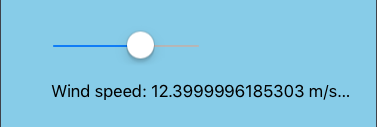
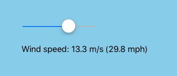
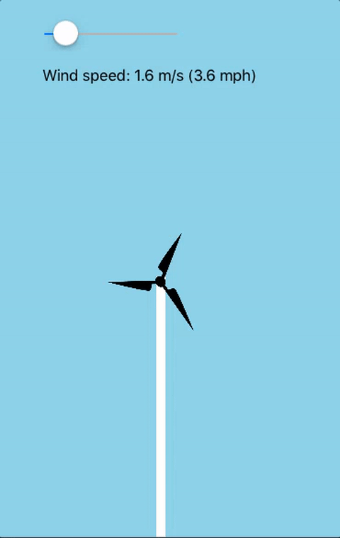

# iOS 10 Day by Day :: Day 7 :: Measurement

Now the excitement has settled over the iPhone 7 announcement, it's time for us to carry on taking a look at the new features iOS 10 provides.

This week we're taking a look at the new Measurements API - a part of the Foundation framework. On the face of it, it doesn't look all that exciting: it provides a mechanism to convert between units such as miles and kilometers.

However, when you think about it, we spend an awful lot more time than we think transforming values. This might be because you have an angle in degrees, but the API you're using to rotate a view requires the angle in radians. Alternatively, it may be because your application calculates distances in miles, but you need to convert into kilometers for your users who prefer to use that unit.

Before iOS 10, you may have created your own functions to transform values to another unit or used an external library. Now Apple have provided an API let's take a look and see what it can do!

## The Basics  

> This post uses Swift 3 released as part of the Xcode 8 GM build.

We use the Measurement model to create our measurement in a particular dimension. You can think of a 'dimension' as being a group of related units which can all be converted between, for example grams can be converted to Kilograms and back again. Each dimension has a base unit, which all other units are defined against (e.g. the base unit for volume is liters, 1 milliliter is defined as being 0.001 liter).

### Creating Our Measurement

To start off simply, let's say I have a pint of milk and want to know how many liters that is:

```swift
let milk = Measurement(value: 1, unit: UnitVolume.imperialPints)
milk.converted(to: .liters)
// prints out 0.568261 L
```
That was easy! Once we've defined our measurement in terms of its unit dimension, we can only convert to other units of that dimension. We get this type checking automatically for us as the type of the `milk` variable is `Measurement<UnitVolume>`. It makes perfect sense that we can only convert to other values in this group... after all, how can we convert a liter of water into a mile?

### Operators

The Measurement API supports the use of operators to manipulate measurements.

If we now want 5 pints of milk we can do:
```swift
let fivePints = milk * 5
```
This returns a new measurement, so we can, in turn, convert this into another unit:

```swift
fivePints.converted(to: .cups)
// Prints 11.8387708333333 cup
```
You'll notice that when using a Playground, or printing the measurement, we get the unit's symbol appended for free.

Of course, multiplication isn't the only operator we can use. Amongst others, we have equality:

```swift
let kms = Measurement(value: 5, unit: UnitLength.kilometers)
let meters = Measurement(value: 5000, unit: UnitLength.meters)

kms == meters // true
```
and addition:
```swift
kms + meters // 10000.0 m
```

## Formatters

I mentioned earlier that we may want to show a different unit based on the current locale.

Along with the new Measurement API, Apple have also provided `MeasurementFormatter` which adds the ability to format a measurement before converting it to a string.

By default, the measurement formatter will use the user's current locale. We'll alter this manually to see what happens when we want to output the distance between two cities:

```swift
let newcastleToLondon = Measurement(value: 248, unit: UnitLength.miles)

let formatter = MeasurementFormatter()
formatter.locale = Locale(identifier: "fr")
formatter.string(from: newcastleToLondon) // Prints 399,166 km

formatter.locale = Locale(identifier: "en_GB")
formatter.string(from: newcastleToLondon) // Prints 248 mi
```
Nice! We get all this while barely having to do any work ourselves!

## Project

We've taken a quick look at the basic usage of the API, so let's have some fun with it.

We'll create a wind turbine with its blades rotating at a speed proportional to the wind speed, which can be adjusted using a slider.

The turbine is a fairly simple UIView subclass. It's added to a UIViewController's view along with some other basic UI elements: the slider to adjust the windspeed and a label that will output the wind speed in both meters per second and miles per hour. If you'd like to view the playground in full, please feel free to have a browse on [GitHub](https://github.com/shinobicontrols/iOS10-day-by-day/tree/master/07%20-%20Measurement).

We'll focus on the components that make use of the Measurement API: first off, let's show the wind speed in the label when the slider's value changes:

```swift
func handleWindSpeedChange(slider: UISlider) {
    let windSpeed = Measurement(value: Double(slider.value), unit: UnitSpeed.metersPerSecond)

    let milesPerHour = windSpeed.converted(to: .milesPerHour)

    windSpeedLabel.text = "Wind speed: \(windSpeed) (\(milesPerHour))"
}
```
Here's what our label looks like:



Woah! We don't need that much precision for our simple demo. At times we are showing so many fractional digits that we can't even see our value in terms of miles per hour. We can solve this by using a `MeasurementFormatter` like we briefly discussed earlier.

```swift
let windSpeed = Measurement(value: Double(slider.value), unit: UnitSpeed.metersPerSecond)

let measurementFormatter: MeasurementFormatter = {
    let formatter = MeasurementFormatter()
    formatter.unitOptions = .providedUnit
    let numberFormatter = NumberFormatter()
    numberFormatter.minimumIntegerDigits = 1
    numberFormatter.minimumFractionDigits = 1
    numberFormatter.maximumFractionDigits = 1
    formatter.numberFormatter = numberFormatter

    return formatter
}()

let metersPerSecond = measurementFormatter.string(from: windSpeed)
let milesPerHour = measurementFormatter.string(from: windSpeed.converted(to: .milesPerHour))

windSpeedLabel.text = "Wind speed: \(metersPerSecond) (\(milesPerHour))"
```
We create our formatter and request it to use the `unitProvided`. This prevents the formatter from ignoring our desired units and outputting the value in what tit thinks is most appropriate. For me, without setting this value, the formatter would result in both our measurements being displayed in terms of miles per hour.

The measurement formatter itself contains another formatter (feels a bit like formatter-ception!) which allows us to format the numeric portion of the measurement. We request the number to show one (and only one) fractional integer.

Finally, we need to use the formatter to extract the string form of our meters per second and miles per hour measurements.



As a bit of visual feedback, we want to increase the frequency of the turbine's rotation as the wind speed increases (note, these values are for educational purposes only and have absolutely no grounding in the physics of harnessing power from the wind ;) ).

The `TurbineView` handles the animation, but we need to supply the angle the blades rotate in a second. You might define a property on the class similar to the following:

```swift
/// The angle the blades rotate per second, in radians.
public var bladeRotationPerSecond: Double
```
This is OK and follows Apple's APIs where angles are supplied in radians. However, what is to stop an unsuspecting user from supplying this value in degrees. You might say: "should have read the docs then". This argument may have some merit, however what if the property didn't have any docs? It's also a pretty simple mistake to make as most of us are used to thinking of angles in terms of degrees.

How about we make use of `Measurement`, constrained only to accept units that are related to angles? This way we can leave the user to supply the angle in whatever they feel most comfortable with and internally convert it to whatever value we need. Sounds good, let's give it a shot:

```swift
// TurbineView property
public var bladeRotationPerSecond: Measurement<UnitAngle> = Measurement(value: 0, unit: UnitAngle.degrees) {
    didSet {
        rotate()
    }
}
```

Within our view controller we can determine the rotations per second with the following code:
```swift
func calculateTurbineRotation() {
    // If we assume max value of slider = 1 rotation per second
    let ratio = windSpeedSlider.value / windSpeedSlider.maximumValue

    let fullRotation = Measurement(value: 360, unit: UnitAngle.degrees)

    let rotationAnglePerSecond = fullRotation * Double(ratio)

    turbine.bladeRotationPerSecond = rotationAnglePerSecond
}
```

We can use the unit of angle that we feel most comfortable with - I chose degrees. Then we make use of the handy multiplier operator to retrieve the rotation angle based on the current wind speed (if the slider's value is 0, then ratio will be 0/40 = 0, whereas on the other end of the scale if slider's value is 40 then ration will be 40/40 = 1).

Here we have our beautifully rotating turbine:



## Further Reading

We've used a few of the unit groupings supplied by Apple, however these are just the tip of the iceberg; there are around 170 different unit types. It's more than likely you'll find the measurement unit you need, however, if you are unable to find the one you need, you can create your own. To find out how to accomplish this (and more!) take a look at the [WWDC video](https://developer.apple.com/videos/play/wwdc2016/238/).
