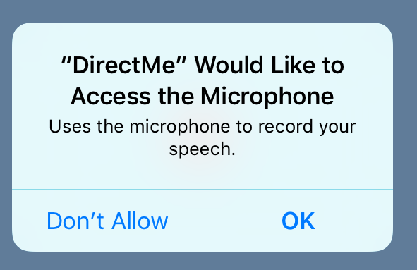
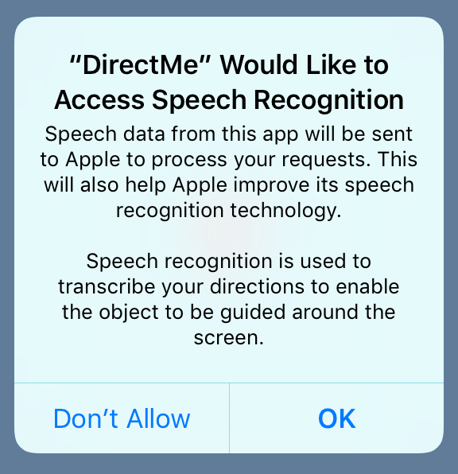

# iOS 10 Day by Day :: Day 8 :: Speech

Let's say you have a recipe app and you'd like to allow your users to work through the steps without having to get flour all over their iOS device. A nice way of adding this functionality might be to allow the user to 'speak' to the app. Before iOS 10 the only choice would have been a third party service, however with Apple's latest release they've opened up the ability to use the same speech recognition software powering Siri.

It's a very flexible API: we can supply a URL which points to some prerecorded audio or we can request it perform 'on the fly' transcription by processing input from the microphone in near-realtime.

## Project

We'll not push the boundaries of speech recognition too far in this blog post. Instead, we'll create an application that allows users to control a ninja and direct it to move around the screen. As with all our posts, the code is available to download on [Github](https://github.com/shinobicontrols/iOS10-day-by-day/tree/master/08%20-%20Speech), should you wish to run it yourself.

### Getting Started

We'll create a new 'Single View Application' project - I chose to call mine 'DirectMe'.

As is often the case with Apple, privacy is of paramount importance. Before we can think about starting to record audio and send it to Apple's servers, we need to request the user's permission and give a reason why we want to perform speech recognition. To do this, we need to add a bit of text for the key `NSSpeechRecognitionUsageDescription` in our `Info.plist`.

While we're in there, we need to add another short bit of text to explain why we wish to use the microphone. For this, we'll use the key `NSMicrophoneUsageDescription`.

We'll add the code that will cause these descriptions to be shown in just a moment, however this is what the alerts will look like:





### Requesting Authorization

We'll keep all of our recording and speech recognition code in a single class named `SpeechTranscriber`.

To begin, we'll need to make sure we import the speech framework using `import Speech` at the top of `SpeechTrancriber.swift`.

Now we'll want to make sure we're authorized to perform speech recognition. The API is very similar to that used in the new Notifications framework we looked at in a [previous post](https://www.shinobicontrols.com/blog/ios-10-day-by-day-day-5-user-notifications). We'll request the user's permission as we initialize our class:

```swift
init() {
    SFSpeechRecognizer.requestAuthorization() {
        status in
        if status == .authorized {
          print("We're good to go!")
        }
        else {
          fatalError("Sorry, this demo is a bit pointless if you disable dictation")
        }
    }
}
```

Great, we've requested permission and hopefully our users will allow us to use... after all, our application will be pretty useless without it! Let's get to the speech recognition code.

### Recognizing Speech

Let's first create a property to store our speech recognizer:

```swift
private let speechRecognizer = SFSpeechRecognizer()
```
The eagle-eyed amongst you may notice that this initializer is 'failable'. This is due to speech recognition not being available in all locales. In this case, we'll just make the assumption that recognition is available, however in a real-world application you'd probably want to update the UI to indicate it's not available.

The core part of getting from a blob of streamed audio data to a human-readable string requires the following two  classes:

`SFSpeechAudioBufferRecognitionRequest` : Encapsulates a request to output speech from the audio data received from the microphone. It can be used to provide hints as to what the audio data contains (e.g dictation, search or whether it's simply confirmation dialogue in the form "yes" or "no").

`SFSpeechRecognitionTask` : Used to monitor the progress of transcribing the data into a string.

To start listening to the user's directions, we expect a call to the `SpeechTranscriber`'s `start` method, which requires the following new properties to be declared:

```swift
/// Whether we are currently listening for audio input.
private(set) var isTranscribing: Bool = false

/// Closure executed when the recording finished and the speech recognizer was able to transcribe it.
var onTranscriptionCompletion: ((String) -> ())?

/// The current request to transcribe audio data into a string
private var recognitionRequest: SFSpeechAudioBufferRecognitionRequest?
```

Now we can set these up and assign objects to them in our method:

```swift
func start() {
   let recognitionRequest = SFSpeechAudioBufferRecognitionRequest()

   do {
       try createAudioSession() {
           buffer in
           recognitionRequest.append(buffer)
       }
   }
   catch {
       fatalError("Error setting up microphone input listener!")
   }

   speechRecognizer?.recognitionTask(with: recognitionRequest) {
       [weak self]
       result, error in
       guard let result = result else {
           print(error?.localizedDescription)
           return
       }

       // Wait until we have the final result before calling our completion block
       if result.isFinal {
           self?.onTranscriptionCompletion?(result.bestTranscription.formattedString)
       }
   }

   // Store request for later use
   self.recognitionRequest = recognitionRequest

   isTranscribing = true
}
```

Above, we create our request and the audio session. The magic happens when we request our `speechRecognizer` instance to kick off the transcribing of our data into speech. As our speech data is arriving in streams, the recognizer may receive data later down the line which makes one particular transcription more likely than another, therefore we wait until the recognizer decides it has a 'final' result before we fire the `onTranscriptionCompletion` completion block.

To keep things simple, we trust the speech recognizer's opinion as to what the best transcription is. For more advanced use cases, you may want to dig into the `result`'s transcriptions. Each instance of `SFTranscription` in turn contains an array of `SFTranscriptionSegment`s which holds information about the duration of the segment and the level of confidence it has in the recognition.

> Setting up the transcriber to receive input from the microphone isn't really part of this blog post and I've pretty much used the exact same implementation as Apple in their [sample project](https://developer.apple.com/library/prerelease/content/samplecode/SpeakToMe). The only difference is our setting up of the audio session passes a closure which accepts an `AVAudioPCMBuffer` object which contains the audio data coming from the microphone. This closure is fired as new data is received.

When the user has finished recording their commands, we'll call the `stop` method, which simply ties up the open request and audio session:

```
func stop() {
    recognitionRequest?.endAudio()
    audioEngine.stop()
    audioEngine.inputNode?.removeTap(onBus: 0)
    isTranscribing = false
}
```
This lets our `speechRecognizer` know that the audio has ended, so we can expect our `SFSpeechRecognitionResult`'s `isFinal` to become `true`.

### Setting Up Our View

Now that we've handled the speech recognition portion of the project, let's convert the speech into instructions to move a ninja around the phone screen. We'll brush over the adding of the ninja to the screen: we simply create a `UIImageView` and pass in our ninja image and then position it at an arbitrary position on the screen.

An important part of using Apple's speech recognition is to make it obvious to the user when they are being recorded. In our case, we'll make them tap a button to begin recording and then tap it again to cancel. We'll add the button to our storyboard and position it at the bottom of the screen. Our starting screen looks something like this:


### Directing the Ninja

Our ninja's sitting there looking like a bit of a lemon at the moment, let's get it doing some exercise by allowing the user to guide it around the screen.

We'll keep things simple and just allow movement in four directions. To record these, let's create an `enum`:

```swift
enum Instruction: String {
    case left
    case right
    case up
    case down
}
```

To convert the user's voice data into `Instruction`s we'll create an instance of our `SpeechTranscriber` class we prepared earlier and assign it to a property:

```swift
let transcriber = SpeechTranscriber()
```

We'll add an IBAction and hook it up to the button we added to the `ViewController`'s storyboard scene which will trigger the starting and stopping of the audio transcription:

```swift
@IBAction func directionsButtonPressed(_ sender: UIButton) {
    if !transcriber.isTranscribing {
        // Not currently listening for directions, so let's start!
        transcriber.start()
        // Update button appearance
        sender.setTitle("End Recording", for: .normal)
        sender.backgroundColor = .red
    }
    else {
        // Already listening, so let's stop the recording
        transcriber.stop()
        // Update button appearance
        sender.setTitle("Record Directions", for: .normal)
        sender.backgroundColor = .green
    }
}
```
Depending on the transcriber's current state, we either start or stop the transcription and then update our button's appearance to reflect it.

We're almost there! We're now recording the audio from the microphone and sending it off to be converted into text, but we need to hook into our completion block on our transcriber class to inform us when the final transcription is available to us.

```swift
transcriber.onTranscriptionCompletion = {
    [unowned self]
    transcription in

    // Parse the string into individual Instructions
    let instructions = transcription.components(separatedBy: " ").flatMap {
        return Instruction(rawValue: $0)
    }

    if instructions.count == 0 {
        return
    }

    for instruction in instructions {
        self.moveNinja(for: instruction)
    }
}
```
All that computing power and all we're doing is just checking for four words: "Up", "Down", "Left" and "Right" and discarding the rest!

For each parsed instruction we then move the Ninja using the following function:

```
func moveNinja(for instruction: Instruction) {
    let movement: CGVector

    // The distance to move in any direction
    let distance = 100

    switch instruction {
    case .left:
        movement = CGVector(dx: -distance, dy: 0)
    case .right:
        movement = CGVector(dx: distance, dy: 0)
    case .down:
        movement = CGVector(dx: 0, dy: distance)
    case .up:
        movement = CGVector(dx: 0, dy: -distance)
    }

    self.ninja.center.x += movement.dx
    self.ninja.center.y += movement.dy
}
```

And our basic app is done! We can try hitting the record button and saying "Move up" which should result in the ninja jump towards the top of the screen.

### A Bit Of Fun: Animating Each Movement

A small bit of gloss on our project: let's animate each instruction in turn so we can see a little more clearly what's going on.

Our updated `onTranscriptionCompletion` now looks like this:

```swift
transcriber.onTranscriptionCompletion = {
    [unowned self]
    transcription in

    // Parse the string into individual Instructions
    let instructions = transcription.components(separatedBy: " ").flatMap {
        return Instruction(rawValue: $0)
    }

    if instructions.count == 0 {
        return
    }

    // So we can see the individual instructions more clearly, we'll animate each one.
    let individualInstructionAnimationDuration = 0.5
    let totalAnimationDuration = Double(instructions.count) * individualInstructionAnimationDuration
    let relativeIndividualDuration = 1 / Double(instructions.count)

    UIView.animateKeyframes(withDuration: totalAnimationDuration, delay: 0, options: [], animations: {
        for (index, instruction) in instructions.enumerated() {

            UIView.addKeyframe(withRelativeStartTime: relativeIndividualDuration * Double(index),
                               relativeDuration: relativeIndividualDuration) {
                self.moveNinja(for: instruction)
                self.view.layoutIfNeeded()
            }
        }
    })
}
```

Let's try this out! Sit back and relax as my dulcet tones guide the ninja around the screen:

// View video located at path 'Images/Speech_Recognizer.mp4'

## Caveats and Further Reading

There are a few caveats to using the new Speech framework.

The API is rate-limited, which means if your app is hammering Apple's servers then you may find some requests are rejected. The advice here seems to be to back off and request the user to try again later.

Another more obvious problem is the service isn't entirely accurate yet. In my simple example, I found it struggled to correctly recognise the word 'down' on many occasions, but that might be just the odd way I say it. The good thing is any changes Apple makes to the recognition algorithm will result in better recognition for your app in the future.

Apple has a list of best practices, along with further documentation about the framework available on their [developer website](https://developer.apple.com/reference/speech). The [WWDC presentation](https://developer.apple.com/videos/play/wwdc2016/509/) is a nice and concise ten minutes and is also worth a watch.
