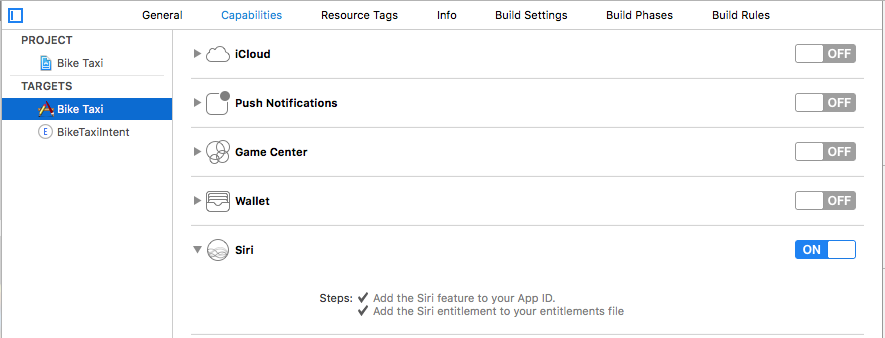
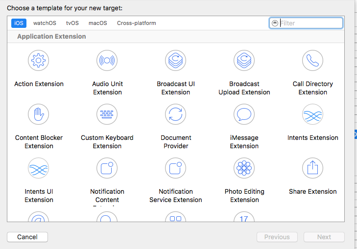
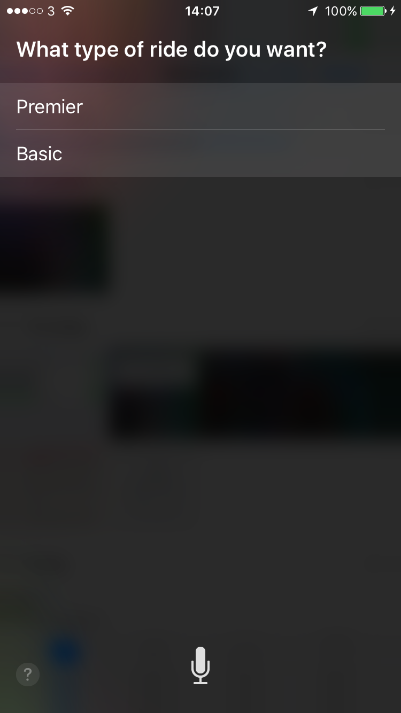

# iOS 10 Day by Day :: Day 9 :: Siri Intents

A longstanding wish of many iOS users has been for Siri integration to be extended beyond the limited selection of Apple apps. Whilst we're nowhere near the utopia of being to accomplish most actions through speaking to our phones, iOS 10 has made a large leap towards that goal, with a limited number of application types now being able to integrate with Siri. The list of application types (or intent domains, as Apple refers to them) can be found in the [SiriKit documentation](https://developer.apple.com/library/content/documentation/Intents/Conceptual/SiriIntegrationGuide/index.html#//apple_ref/doc/uid/TP40016875).

Before we dive into creating our own Siri integration, it's worth clarifying what SiriKit is. The 'kit' comprises two frameworks: `Intents` and `IntentsUI`. The `Intents` framework is the fundamental component that enables your application to integrate with Siri, whereas `IntentsUI` enables you to customize the way your integration is displayed within Siri's UI. In this post, we'll focus on adding the basic integration and then add our custom UI in a following post.

> Those of you following along with this series of blog posts may notice the striking similarity in structure between SiriKit and the two new notification frameworks (`UserNotifications` and `UserNotificationsUI`) we looked at in a [previous](https://www.shinobicontrols.com/blog/ios-10-day-by-day-day-5-user-notifications) [posts](https://www.shinobicontrols.com/blog/ios-10-day-by-day-day-6-notification-content-extensions).

## Project

To demonstrate the architecture of a typical Siri integration, we'll create a ride booking service that allows users to book a cyclist to pick them up and take them anywhere (!) in the UK. We won't be focussing on the implementation too much; this should mean that most of the concepts we discuss below will be relevant no matter which intent domain your app falls under. As with all the other posts, the code is available on [GitHub](https://github.com/shinobicontrols/iOS10-day-by-day/tree/master/09%20-%20Siri%20Intents) should you wish to run the project yourself.

Pretty much any third-party functionality that extends iOS is done via the use of Extensions and integrating with Siri is no different. We'll need to create a dummy application (I chose the time-old 'Single View Application' template) that requests authorization to use Siri. Normally anything you can do via Siri should be possible through the app as well, however we'll just focus on the Siri side of things to keep it simple.

### Getting Authorization

As in our project integrating the new [`Speech` framework](https://www.shinobicontrols.com/blog/ios-10-day-by-day-day-8-speech), we'll need to respect the user's privacy by showing a short sentence about what information our app shares with Siri using the `NSSiriUsageDescription` key within the iOS app's `Info.plist`.

We'll also need to add 'Siri' to our Application's capabilities.



Finally, we'll need to request authorization from the user, which will present them with an alert allowing them to accept or decline our request to integrate with Siri.

```swift
import UIKit
import Intents

class ViewController: UIViewController {

    override func viewDidLoad() {
        super.viewDidLoad()

        INPreferences.requestSiriAuthorization {
            status in
            if status == .authorized {
                print("Wonderful!")
            }
            else {
                print("Hmmm... This demo app is going to pretty useless if you don't enable Siri. Fancy changing your mind?")
            }
        }
    }
}
```
This results in the following:


Our app now displays amongst other Siri-enabled applications. The user can choose to enable/disable Siri integration on  a per-app basis.


## Intent Handling

### Overview

First of all... what's an "intent"? Simply put, it contains the data Siri has gathered from the user for a particular, distinct action (starting, pausing and ending a workout all have different `Intent` classes). Each domain has specific intents and Siri does the work determining which intent the user desired, which makes our job a lot easier.

All intents, no matter the domain, integrate with Siri in the same way:

1. `SiriKit` checks your Intent extension's `Info.plist` to determine which intents you support, using the `IntentsSupported` key.
2. Using the `NSExtensionPrincipalClass`, `SiriKit` will launch your extension and then request the `IntentHandler` for a given `Intent` from this principal class. Note, the default is that the principal class will be the handler.
3. Now, we have a way of handling an `Intent`, we'll want to resolve each parameter of the `Intent` to ensure we have enough information to carry out what the user is asking of us, such as ensuring they've supplied us with the class of transport they want ("Business" or "Economy"). We also want to validate any parameters, such as checking that the drop-off destination is within the taxi company's catchment area.
4. After resolving, we have one more chance to request information from the user before we're expected to handle the intent. This is also a good place to check we have a network connection if we need to do anything like contacting a backend system when booking the ride.
5. Finally, we need to handle the intent. In our case, this will be to book the taxi and dispatch it to the user. If sending money, then this would be to carry out the transaction.

### Adding Our Intent Extension

Now we know what an intent is and the different stages we need to go through, let's add our extension to the project by adding a new target and selecting "Intents Extension"



We'll leave the UI component alone for now by unchecking "Include UI Extension" and return to that in our next post


We're almost ready to get into the fun part, however we just need to specify the `Intent` types our extension can handle. To keep it simple, we'll only add the ability to book a ride. To declare this, we need to open up our extension's `Info.plist` and provide a list of supported intents, simply one in our case: `INRequestRideIntent`. To see a list of all intents for each domain see this [section of the documentation](https://developer.apple.com/library/content/documentation/Intents/Conceptual/SiriIntegrationGuide/SiriDomains.html#//apple_ref/doc/uid/TP40016875-CH9-SW2).

If you switch over to `IntentHandler.swift`, you'll see the code is for handling intents in the message domain. We want to alter our `IntentHandler` to conform to the `INRequestRideIntentHandling` protocol.

```swift
class IntentHandler: INExtension {
}

extension IntentHandler: INRequestRideIntentHandling {}
```

We'll add our resolution, confirmation and handler method implementations in the next few sections.

### Resolving Parameters

Resolution of parameters is not compulsory, however Apple strongly recommend implementing all resolution methods in order to obtain as much information from the user as is required. This will avoid users getting into stressful situations such as finding out the taxi they booked is not large enough for the number of people waiting to catch their soon-to-depart train.

We have four resolution methods within the `INRequestRideIntentHandling` protocol that our intent handler conforms to. Let's make sure the user gives us the type of ride they'd like - they have two options: "Premier" and "Basic".

```swift
enum BikeTaxiClass: String, CustomStringConvertible {
    case premier
    case basic

    // Uppercases the first letter (e.g. .premier becomes Premier)
    var description: String {
        let characters = self.rawValue.characters
        let first = String(characters.prefix(1)).capitalized
        let other = String(characters.dropFirst())
        return first + other
    }
}

extension IntentHandler {
    @objc(resolveRideOptionNameForRequestRide:withCompletion:)
    func resolveRideOptionName(forRequestRide intent: INRequestRideIntent, with completion: @escaping (INSpeakableStringResolutionResult) -> Void) {

        if let rideName = intent.rideOptionName?.spokenPhrase?.lowercased(),
            let taxiClass = BikeTaxiClass(rawValue: rideName) {

            let speakableString = INSpeakableString(identifier: "", spokenPhrase: taxiClass.description, pronunciationHint: taxiClass.description)
            let result = INSpeakableStringResolutionResult.success(with: speakableString)
            completion(result)
            return
        }

        let premier = BikeTaxiClass.premier.description
        let premierSpeakableString = INSpeakableString(identifier: "", spokenPhrase: premier, pronunciationHint: premier)

        let basic = BikeTaxiClass.basic.description
        let basicSpeakableString = INSpeakableString(identifier: "", spokenPhrase: basic, pronunciationHint: basic)

        let result = INSpeakableStringResolutionResult.disambiguation(with: [premierSpeakableString, basicSpeakableString])

        completion(result)
    }
    // Other resolution methods
}
```
Although it may look a little daunting, all we're really doing is checking if Siri has gathered a ride option type we recognize. If so, then we create a successful resolution result which is passed into the completion block as a parameter. Alternatively, if we don't recognize the ride type, we ask the user to 'disambiguate' between our two options. This will result in Siri going back to the user and presenting them with this list (see image below), which the user will have to respond to before moving on to the next stage of handling the intent.

There are a number of different resolution results, with some being inherited from the base `INIntentResolutionResult` class (results include: `needsValue`/`notRequied`/`unsupported`). Other, less generic, results are defined within concrete subclasses, such as the class used above, `INSpeakableStringResolutionResult`.



The other resolution methods take on a very similar form to the one above, but simply pass slightly different resolution results to their completion blocks. If you'd like to take a look, please fee free to browse through the file on GitHub.

### Confirmation

Confirmation is another phase which is optional, but is again recommended by Apple. This is the last chance for you to verify the parameters after having been resolved. Any backend systems that need to be contacted should be tested here to ensure a connection is available.

In our dummy example, we'll just assume we're good to go, but we'll implement the method anyway and let Siri know we're ready to handle the request:

```swift
extension IntentHandler {
    @objc(confirmRequestRide:completion:)
    func confirm(requestRide intent: INRequestRideIntent, completion: @escaping (INRequestRideIntentResponse) -> Void) {
        // Verify network connection to our state-of-the-art ride booking service is available

        // Let's say it is
        let responseCode = INRequestRideIntentResponseCode.ready
        let response = INRequestRideIntentResponse(code: responseCode, userActivity: nil)

        // Move on to the handling stage
        completion(response)
    }
}
```

At this point, depending on the `Intent` type, Siri may ask for confirmation from the user that they wish to go ahead with the request. When booking a ride via our app, the user is presented with the following:


### Handling

Right then, we've been through the arduous process of checking the user has supplied us with all the information we need and ensured we have a network connection; it's now time to book the ride!

```swift
func handle(requestRide intent: INRequestRideIntent, completion: @escaping (INRequestRideIntentResponse) -> Void) {

    // Our fictional company has unlimited numbers of drivers, all called John Appleseed, so we'll always be able to get to the user.
    let responseCode = INRequestRideIntentResponseCode.success

    let response = INRequestRideIntentResponse(code: responseCode,
                                               userActivity: nil)

    // Set up the driver info
    let driverHandle = INPersonHandle(value: "john@biketaxis.com", type: .emailAddress)
    var personComponents = PersonNameComponents()
    personComponents.familyName = "Appleseed"
    personComponents.givenName = "John"

    let formatter = PersonNameComponentsFormatter()

    let driver = INRideDriver(personHandle: driverHandle,
                              nameComponents: personComponents,
                              displayName: formatter.string(from: personComponents),
                              image: nil,
                              contactIdentifier: nil,
                              customIdentifier: nil)

    let vehicle = INRideVehicle()
    vehicle.model = intent.rideOptionName!.spokenPhrase! // Model name will be "Basic" or "Premier"
    // Hardcode the location to be center of Newcastle, UK
    vehicle.location = CLLocation(latitude: 54.978252,
                                  longitude: -1.6177800000000389)

    // The important part - combining all the above information
    let status = INRideStatus()
    status.driver = driver
    status.vehicle = vehicle
    status.phase = .confirmed
    status.pickupLocation = intent.pickupLocation
    status.dropOffLocation = intent.dropOffLocation

    response.rideStatus = status

    completion(response)
}
```
Most of the above method is setting up our driver's dummy data and then packaging it up inside of an `INRideStatus` instance. This lets SiriKit know that the booking has been confirmed. Each intent response is constructed in a similar manner, be it for requesting payment or booking a taxi. The response contains a code indicating whether we were able to carry out the intent, an optional `NSUserActivity` which will be passed to our app when launched and then often an object that contains specific information related to that intent, in our case `INRideStatus`.

To test out the handling, let's order a taxi and follow the process from start to finish:

// See video SiriKit_Intents.mp4

> Note that you can only test your Intent extension on a device.

## Further Reading

I hope that's been useful and you have learned something even if you're planning on implementing one of the many other intents. Apple's made a great start on third-party Siri integration and I was pleasantly surprised by how well it worked on the whole; I was expecting to get a lot more frustrated than I did! Picking a simple application name certainly helped. Initially I went for a more obscure name which Siri struggled to pick it up and instead kept presenting me with restaurant suggestions. Custom vocabulary can be defined using a [special plist file](https://developer.apple.com/library/content/documentation/Intents/Conceptual/SiriIntegrationGuide/SpecifyingCustomVocabulary.html#//apple_ref/doc/uid/TP40016875-CH6-SW1). This also allows us to inform Siri of phrases that may be used to use our extension. I didn't supply these, however, and instead relied on using the standard phrases Siri already recognizes, such as "Book me a ride using Bike Taxi" or "Pick me up from London using Bike Taxi"

Finally, debugging Siri works as any normal app: you can set breakpoints and print messages to the console. I found when running the extension from Xcode any initial attempt to use my extension would fail and Siri would prompt me to open the app. Any subsequent attempt would normally succeed, so I feel like there may be a timeout issue when connecting the debugger to the extension.

For more information, the [SiriKit Programming Guide](https://developer.apple.com/library/content/documentation/Intents/Conceptual/SiriIntegrationGuide/SpecifyingCustomVocabulary.html#//apple_ref/doc/uid/TP40016875-CH6-SW1) goes through how to create an extension in a lot of detail, and [WWDC video](https://developer.apple.com/videos/play/wwdc2016/217/) is also worth a watch.
