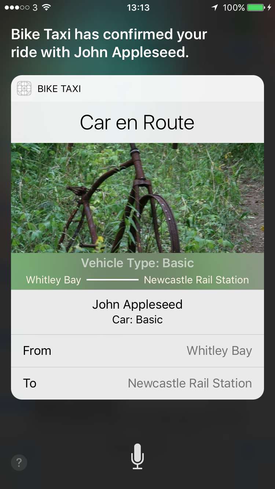
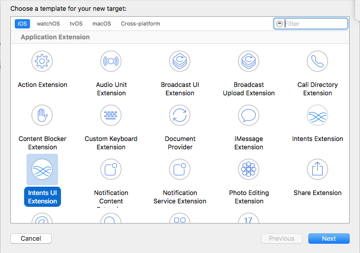
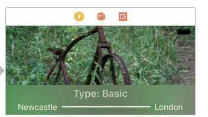

# iOS 10 Day by Day :: Day 10 :: SiriKit Intents UI

In the [last blog post](https://www.shinobicontrols.com/blog/ios-10-day-by-day-day-9-sirikit-intents), we looked at integrating a ride booking app with Siri using the new `Intents` framework. This enabled users to book a vehicle to pick them up and drop them off without having to use the application (which is just as well, as our main application didn't have that functionality!).

Not only have Apple added the integration with Siri, they've also added a way to customize the UI presented within Siri using another framework falling under the 'SiriKit' umbrella called `Intents UI`.

Your customized UI can supply just a single view controller. This view controller acts in the exact same manner as those used in a `Notification Contents Extension` - we looked at these in [Day 6](https://www.shinobicontrols.com/blog/ios-10-day-by-day-day-6-notification-content-extensions). You can perform animations and add other code as you would any standard UIViewController, however the user can not interact with the UI.

## Project

Building on the project we created last time, we'll add a simple interface to display a picture of the ride type a user has requested as well as the pick-up and drop-off locations. As ever, please feel free to download and run the project by [cloning the repository on GitHub](https://github.com/shinobicontrols/iOS10-day-by-day).

To whet your appetite, here's a screenshot of what our integration will look like by the end of this post:



### Adding a New Target

Before adding the interface, we need to add a new target to our project.



The target's template sets up almost all the configuration for us, however it's worth taking a quick look at the UI extension's `Info.plist`. It's very similar to that of our Intent Extension:

- Describe the intents supported by this particular Intents UI Extension. We need to change the list of `IntentsSupported` to only include `INRequestRideIntent`. This tells the system that when Siri decides the user is requesting a ride and will therefore begin communicating with our Intents Extension, it should display our custom UI at the 'confirmation' and 'handled' stages.
- The storyboard used to design the interface (we'll leave this as the default '`MainInterface`').
- The extension point identifier: `com.apple.intents-ui-service`. We don't want to touch this, but it simply tells the system what kind of extension it is.

### Designing the UI

I set up the UI in the `MainInterface` storyboard. It contains just a few labels and a large background image - oh and a bit of blur to jazz it up a bit!



The pick-up, drop-off, ride-type labels and the background image view are connected to the controller via `IBOutlet`s. We'll use these in the next section so the UI reflects what the user has requested.

```swift
class IntentViewController: UIViewController, INUIHostedViewControlling {

    @IBOutlet weak var pickUpLocationLabel: UILabel!
    @IBOutlet weak var dropOffLocationLabel: UILabel!

    @IBOutlet weak var bikeTypeLabel: UILabel!

    @IBOutlet weak var rideImageView: UIImageView!
}
```

### Configuring the UI from Intent Data

Now we have the design, let's get the interface displaying the information passed to us by Siri.

If you looked closely at the code snippet in the above section, you'd have seen our `IntentViewController` conforms to the `INUIHostedViewControlling` protocol. This contains a single method `configure` which enables us to pull the data gathered by Siri into our interface. Once we've finished configuring our view, we should call the completion block with the size we desire our interface to be displayed at.

First of all, we use the following computed property to obtain the size to display our view. In our case, we wish to display at the largest size we can. We'll pass this size into the completion block in just a bit.

```swift
var desiredSize: CGSize {
    return self.extensionContext!.hostedViewMaximumAllowedSize
}
```

Now to setting the label text and image:

```swift
func configure(with interaction: INInteraction!, context: INUIHostedViewContext, completion: ((CGSize) -> Void)!) {

    let intent = interaction.intent as! INRequestRideIntent
    let rideName = intent.rideOptionName?.spokenPhrase
    let pickUpLocation = intent.pickupLocation
    let dropOffLocation = intent.dropOffLocation
```
We pull the ride name and the location details from the intent handed to us by SiriKit. In your application, you'd want to pull this data from the `IntentResponse` object, rather than the intent itself. The intent is the data as requested by the user, whereas the 'intent response' is created by your Intent Extension after having vetted the user's intent.

```swift
    let bikeTaxiClass = BikeTaxiClass(rawValue: rideName!.lowercased())!
```
From the ride name, we create the appropriate enum case from the rideName (either `.premier` or `.basic`). We'll use this to determine which image to show in the next code snippet.

```swift
    // Configure the image type
    rideImageView.image = bikeTaxiClass == .basic ? #imageLiteral(resourceName: "basic") : #imageLiteral(resourceName: "premier")

    // Set the pick-up and drop-off points
    pickUpLocationLabel.text = pickUpLocation?.name ?? ""
    dropOffLocationLabel.text = dropOffLocation?.name ?? ""

    bikeTypeLabel.text = "Vehicle Type: \(bikeTaxiClass)"
````
We show the relevant image using the handy `#imageLiteral` syntax and set the text label text.

```swift
    if let completion = completion {
        completion(self.desiredSize)
    }
}
```
Finally, as we're all finished, we call the completion block passing in the size at which we wish to display our UI.

> Although beyond the scope of this post, the `INInteraction` object passed into the above method encapsulates all the communication handled by SiriKit and your extension. We simply use it to pull out the intent data, however I'd recommend [reading the docs](https://developer.apple.com/library/content/documentation/General/Conceptual/ExtensibilityPG/ExtensionScenarios.html#//apple_ref/doc/uid/TP40014214-CH21-SW5) to find out how you can become a 'better iOS citizen' by improving the user's experience when using iOS.

Here's how it's looking.


### Hiding Siri's Map

We already show the pick-up location in our custom view, so the map is perhaps a little redundant. We can hide it very simply by conforming to another protocol:

```swift
extension IntentViewController: INUIHostedViewSiriProviding {
    var displaysMap: Bool { return true }
}
```
`INUIHostedViewSiriProviding` enables the hiding of other interface elements that may be displayed depending on the intent type.

And there we go. In around fifty lines of code, we've added our own custom UI that's now displayed within Siri's interface. Let's take a look at the confirmation screen in all its glory:


### Sharing Code Between App and Intents Extensions

In a normal app, extensions will have a subset of the main application's features. In our case, we need to share the `BikeTaxiClass` enum between both the Intents UI and Intents Extensions. For this simple project, I just moved the enum into a separate file and then added this to both extension targets. The best way to go about sharing common code is to package it up into a private framework which is then added to the targets that require it. Apple recommends this approach in their [App Extension Programming Guide](https://developer.apple.com/library/content/documentation/General/Conceptual/ExtensibilityPG/ExtensionScenarios.html#//apple_ref/doc/uid/TP40014214-CH21-SW5).

## Further Reading

The `IntentsUI` framework provides a very simple way to add a bit more personality to your Siri integration. If you'd like to find out more, I'd recommend watching the ['Extending Your Apps with SiriKit'](https://developer.apple.com/videos/play/wwdc2016/225/) video from WWDC. In the video, they also go into general best practices as to how to design your integration.
